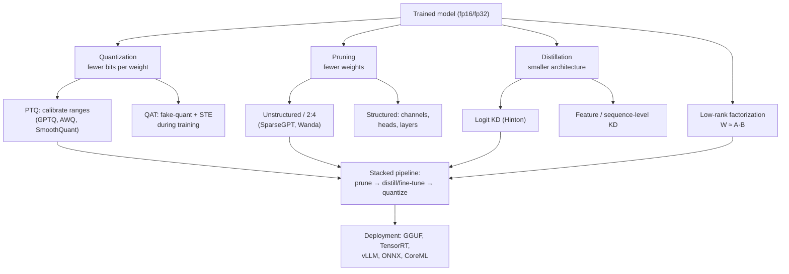
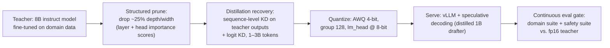

# 6.4 — Model Compression (Quantization, Pruning, Distillation)

## 1. Overview

**What is it?** Model compression is the family of techniques that shrink a trained neural network — fewer bits per weight (quantization), fewer weights (pruning), a smaller architecture trained to imitate a larger one (distillation), or lower-rank re-parameterizations (factorization) — while preserving as much accuracy as possible.

**Why does it exist?** Neural networks are massively overparameterized: many weights are redundant, near-zero, or expressible in far fewer bits than the 32 they were trained in. Meanwhile, inference — not training — dominates the lifetime cost of a deployed model. A model is trained once but queried billions of times.

**What problem does it solve?** Compression converts redundancy into deployment wins: a 7B-parameter LLM at fp16 needs 14 GB of weight memory and is *memory-bandwidth bound* at generation time; at 4 bits it needs 3.5 GB, fits on a laptop GPU, and generates tokens roughly proportionally faster. Compression also enables on-device (phone, car, browser) inference where no datacenter round-trip is possible.

**Where is it used?** Everywhere models ship: 4-bit LLMs via llama.cpp and GGUF, INT8 serving in TensorRT and vLLM, DistilBERT-style students in production NLP pipelines, pruned and quantized vision models on phones (Apple, Google), and distilled "mini/flash/turbo" variants of frontier models.

## 2. Learning Objectives

After this chapter you will be able to:

- Derive the affine quantization mapping (scale and zero-point) from a tensor's dynamic range.
- Distinguish symmetric vs. asymmetric and per-tensor vs. per-channel/per-group quantization.
- Explain post-training quantization (PTQ) vs. quantization-aware training (QAT), and the straight-through estimator that makes QAT possible.
- Describe how GPTQ and AWQ quantize LLMs to 4 bits and why activation outliers make LLM quantization hard.
- Implement magnitude pruning and explain structured vs. unstructured sparsity trade-offs.
- Derive the knowledge-distillation loss, including why the $T^2$ factor appears.
- Explain low-rank factorization of weight matrices and its relation to [LoRA](../phase-3-nlp-llm/07-lora-peft.md).
- Compute memory savings and estimate speedups for a given compression configuration.
- Choose the right technique (or stack of techniques) for a deployment target.
- Evaluate a compressed model properly — beyond perplexity.
- Recognize the standard failure modes: missing calibration, outlier channels, tokenizer mismatch in distillation, pruning without recovery fine-tuning.

## 3. Prerequisites

| Chapter | Why you need it |
|---|---|
| [Backpropagation](../phase-2-deep-learning/02-backpropagation.md) | QAT propagates gradients through non-differentiable rounding via the straight-through estimator. |
| [Loss Functions](../phase-2-deep-learning/04-loss-functions.md) | Distillation combines cross-entropy with KL divergence — both defined there. |
| [Optimizers](../phase-2-deep-learning/05-optimizers.md) | QAT and recovery fine-tuning are ordinary SGD/Adam training loops. |
| [Transformers](../phase-2-deep-learning/10-transformer.md) | All LLM-specific methods (GPTQ, AWQ) operate on transformer linear layers. |
| [PCA](../phase-1-classical-ml/13-pca.md) | Low-rank factorization is truncated SVD — the same math as PCA. |
| [LoRA & PEFT](../phase-3-nlp-llm/07-lora-peft.md) | QLoRA combines 4-bit quantization with low-rank adapters; the rank intuition transfers directly. |
| [Distributed Training](03-distributed-training.md) | Memory math (bytes/parameter) introduced there is reused here for inference. |

## 4. Intuition

Think of a trained neural network as a manuscript written by a very verbose author. Compression is editing, and each technique is a different kind of edit:

- **Quantization** is rewriting every number with fewer decimal places. "The distance is 42.1937264 km" becomes "about 42 km" — almost always enough, and the sentence gets much shorter. The art is choosing the rounding grid so the *important* distinctions survive.
- **Pruning** is deleting words that carry no meaning. Most manuscripts survive losing half their adverbs; most networks survive losing half their near-zero weights. But delete scattered single letters (unstructured pruning) and the printing press gains nothing — delete whole paragraphs (structured pruning: channels, heads, layers) and the book physically shrinks.
- **Distillation** is hiring the great author to *teach an apprentice* rather than photocopying the book. Crucially, the teacher doesn't just give the apprentice the final answers (hard labels); it shares its *doubts* — "this is a 7, but honestly it looks a bit like a 1" — and those soft judgments contain far more information per example than the answer key.

An everyday story for why soft labels matter: two students prepare for the same exam. One studies only the answer key (hard labels). The other studies with a tutor who explains, for every question, how confident to be and which wrong answers are *almost* right (soft labels). The second student learns the structure of the subject, not just the answers — and generalizes better from the same number of questions. That is Hinton's "dark knowledge."

And for quantization's central tension: a thermometer that reads 0–1000° in whole degrees is useless for cooking sous-vide at 55.5°. The range you must cover and the precision you need fight over the same few bits. Activation *outliers* in LLMs are exactly this — one channel spiking to 100 forces the grid so coarse that all the well-behaved values near 1 collapse to the same bucket. Modern LLM quantization (SmoothQuant, AWQ) is mostly outlier management.

## 5. Real-world Motivation

- **The llama.cpp / GGUF ecosystem** made 4-bit LLM inference on consumer laptops and phones a mass phenomenon — millions of downloads of quantized Llama, Mistral, and Qwen checkpoints on Hugging Face.
- **Hugging Face's DistilBERT** (40% smaller, 60% faster, ~97% of BERT's GLUE score) became one of the most-downloaded models ever — distillation as a product, not a paper.
- **Apple** runs quantized on-device foundation models in Apple Intelligence (publicly documented low-bit palettized weights) so requests never need to leave the phone for common tasks.
- **Google** ships distilled and quantized models on Android (Gemini Nano on-device) and pioneered INT8 deployment with TensorFlow Lite and TPU inference; DistilBERT-class students power latency-critical ranking features.
- **OpenAI, Anthropic, and Google** all sell "mini/flash/haiku" tiers — smaller, cheaper siblings of frontier models. The labs don't disclose exact recipes, but distillation is the openly-discussed industry pattern for producing them, and open efforts (DeepSeek-R1's distilled variants, Llama-3.2's pruned-and-distilled 1B/3B) publish theirs.
- **NVIDIA TensorRT-LLM and vLLM** serve INT8/FP8/INT4 models in production; Meta's Llama-3.2 release included officially quantized (QLoRA/SpinQuant) checkpoints.

The economics: inference cost scales with bytes moved and FLOPs executed per token. A 4× smaller model on the same hardware is, to first order, ~4× cheaper to serve at memory-bound batch sizes.

## 6. Mathematical Foundations

### 6.1 Affine (asymmetric) quantization — scale and zero-point

Map real values $x \in [\beta_{\min}, \beta_{\max}]$ (the *calibration range*) onto $b$-bit integers $q \in [q_{\min}, q_{\max}]$ (e.g., $[-128, 127]$ for signed INT8, $[0, 255]$ unsigned). Define:

$$s = \frac{\beta_{\max} - \beta_{\min}}{q_{\max} - q_{\min}}, \qquad z = \text{round}\!\left(q_{\min} - \frac{\beta_{\min}}{s}\right),$$

where $s$ (the **scale**, a positive real) is the width of one quantization step and $z$ (the **zero-point**, an integer) is the integer that represents real zero. Quantize and dequantize:

$$q = \text{clip}\!\left(\text{round}\!\left(\frac{x}{s}\right) + z,\; q_{\min},\, q_{\max}\right), \qquad \hat{x} = s\,(q - z).$$

The zero-point exists so that the real value $0.0$ is representable *exactly* — essential because zero-padding and ReLU outputs must not acquire a bias. **Symmetric quantization** sets $z = 0$ and $s = \frac{\max |x|}{q_{\max}}$; it is cheaper (no zero-point arithmetic in matmuls) and standard for weights, while activations (often skewed, e.g. post-ReLU) benefit from asymmetric.

**Quantization error.** Rounding introduces error $\epsilon = \hat{x} - x \in [-s/2, s/2]$. Modeling $\epsilon$ as uniform on that interval gives mean-square error $\mathbb{E}[\epsilon^2] = s^2/12$ — halving $s$ (one extra bit) quarters the noise power, i.e. ~6 dB SNR per bit. This is why the jump from 4→3 bits hurts vastly more than 8→7: $s$ doubles each bit you remove.

**Granularity.** One $(s, z)$ pair per tensor (per-tensor) is coarsest; per-output-channel (weights) and per-group (e.g., every 128 weights, standard in 4-bit LLM formats) shrink the range each scale must cover, cutting error where distributions vary across channels.

### 6.2 Integer matmul

With symmetric per-channel weights $W \approx s_w \odot Q_W$ and per-tensor activations $x \approx s_x (Q_x - z_x)$:

$$y = Wx \approx s_w s_x \left( Q_W Q_x - z_x Q_W \mathbf{1} \right),$$

so the heavy work is an integer matrix multiply ($Q_W Q_x$) on fast INT8 tensor cores, followed by a cheap floating-point rescale. The $z_x Q_W \mathbf{1}$ correction term can be precomputed per row — this is why symmetric weights + asymmetric activations is the standard pairing.

### 6.3 PTQ vs. QAT and the straight-through estimator

**PTQ** quantizes a finished model using a few hundred calibration batches to estimate ranges (min/max, percentile, or MSE-optimal clipping). Cheap, no training loop, usually lossless at INT8.

**QAT** inserts *fake-quantization* (quantize → dequantize) into the forward pass during training, so the network learns weights that are robust to rounding. Problem: $\text{round}(\cdot)$ has zero gradient almost everywhere. The **straight-through estimator (STE)** simply defines the backward pass of rounding as identity:

$$\frac{\partial\, \text{round}(u)}{\partial u} := 1 \quad \text{(within the clipping range, else } 0\text{)},$$

a biased but empirically excellent approximation — gradients flow as if quantization were transparent, while the forward pass sees true quantized values. QAT recovers most of the accuracy PTQ loses at 4 bits and below.

### 6.4 GPTQ — error-compensating second-order PTQ

GPTQ quantizes an LLM's weight matrices column by column, minimizing the *layer output* error $\|WX - \hat{W}X\|_2^2$ over calibration activations $X$, not the weight error. Using the layer Hessian $H = 2XX^\top$, after quantizing weight $w_q$ it updates the remaining (not-yet-quantized) weights to absorb the induced error:

$$\delta = -\frac{w_q - \text{quant}(w_q)}{[H^{-1}]_{qq}} \, [H^{-1}]_{:,q},$$

a per-column Optimal Brain Surgeon step made tractable by Cholesky tricks. Result: 3–4-bit quantization of 175B models in a few GPU-hours with small perplexity loss.

### 6.5 AWQ — activation-aware scaling

Observation: ~1% of weight channels are "salient" because they multiply activations with *large magnitudes*; quantizing them coarsely does disproportionate damage. AWQ rescales per channel before quantization — $W' = W \cdot \text{diag}(s)^{-1}$, $x' = \text{diag}(s)\, x$ — choosing $s$ (from activation statistics) so salient channels get effectively finer resolution, with the mathematically equivalent inverse scaling folded into the previous layer. No backprop needed; hardware-friendly; the default for 4-bit serving in vLLM/TensorRT-LLM. SmoothQuant applies the same migration idea to make *activations* INT8-friendly by shifting difficulty onto weights.

### 6.6 Pruning

**Magnitude pruning** keeps the top-$k$ weights by $|w|$ and zeroes the rest — the simplest instance of saliency-based pruning. Second-order methods score weights by loss increase: from a Taylor expansion around the trained optimum ($\nabla L \approx 0$),

$$\Delta L \approx \tfrac{1}{2}\, \delta w^\top H\, \delta w \;\Rightarrow\; \text{saliency}(w_i) = \frac{w_i^2}{2 [H^{-1}]_{ii}} \quad \text{(Optimal Brain Surgeon)},$$

which is exactly the machinery GPTQ reuses. **Unstructured** sparsity (individual zeros) reaches 90%+ with little accuracy loss but needs sparse kernels or NVIDIA's 2:4 semi-structured format (2 zeros per group of 4 → real tensor-core speedup) to pay off. **Structured** pruning removes whole channels/heads/layers — smaller dense model, universal speedup, but coarser and costlier in accuracy. LLM-scale one-shot methods: SparseGPT (OBS-style with the GPTQ solver) and Wanda (score $= |w| \cdot \|x\|$, no Hessian). The **lottery ticket hypothesis** (Frankle & Carlin) observes that dense training may mostly serve to find a sparse trainable subnetwork.

### 6.7 Knowledge distillation — loss derivation

Teacher logits $u$, student logits $v$, temperature $T$. Softened distributions:

$$p_i = \frac{e^{u_i/T}}{\sum_j e^{u_j/T}}, \qquad q_i = \frac{e^{v_i/T}}{\sum_j e^{v_j/T}}.$$

Temperature $T > 1$ flattens the distribution, amplifying the relative information in small logits (the "dark knowledge": *which* wrong classes are plausible). The distillation objective mixes hard-label cross-entropy and soft-label KL divergence:

$$L = \alpha\, L_{\text{CE}}(y, \sigma(v)) \;+\; (1 - \alpha)\, T^2\, D_{\text{KL}}\!\left(p \,\|\, q\right), \qquad D_{\text{KL}}(p\|q) = \sum_i p_i \log \frac{p_i}{q_i}.$$

**Why the $T^2$?** Differentiate the soft term w.r.t. a student logit: $\frac{\partial}{\partial v_i} D_{\text{KL}}(p\|q) = \frac{1}{T}(q_i - p_i)$, and each softened logit contributes another $1/T$ — soft-loss gradients scale as $1/T^2$. Multiplying by $T^2$ keeps the hard and soft gradient magnitudes comparable as you tune $T$, so $\alpha$ and $T$ can be tuned independently. A satisfying limit: as $T \to \infty$, the soft gradient $\to \frac{1}{T^2}(v_i - u_i)/N$ — distillation degenerates to logit matching (MSE on logits), which is itself a useful variant. Feature/hidden-state matching (TinyBERT, MiniLM) and sequence-level distillation (train the student on teacher *generations*, the standard for LLMs) extend the idea beyond logits.

### 6.8 Low-rank factorization

Any weight matrix $W \in \mathbb{R}^{m \times n}$ has an SVD $W = U \Sigma V^\top$. Keeping the top $r$ singular values gives the *optimal* rank-$r$ approximation (Eckart–Young theorem) in Frobenius norm:

$$W \approx (U_r \Sigma_r)(V_r^\top) = AB, \quad A \in \mathbb{R}^{m \times r},\; B \in \mathbb{R}^{r \times n},$$

replacing $mn$ parameters and multiply-adds with $r(m+n)$ — a win whenever $r < \frac{mn}{m+n}$. In practice, *activation-weighted* SVD (minimize $\|WX - ABX\|$) beats plain SVD, and factorization pairs naturally with fine-tuning to recover accuracy. LoRA is the training-time twin: learn only a low-rank *update* $\Delta W = AB$ on top of frozen $W$.

## 7. Visual Explanation

The compression toolbox and how techniques stack:



Affine quantization on a number line (INT8, asymmetric):

```
real axis:   β_min = -0.7                        0.0                     β_max = +2.1
              |———————————|———————————|———— ... ——|—— ... ———————————————|
integers:   q=-128       -96         -64        z=-64+round(0.7/s)      q=+127
              step size s = (2.1 − (−0.7)) / 255 ≈ 0.011
              every real x is snapped to the nearest tick: error ≤ s/2 ≈ 0.0055
```

## 8. Algorithm

**INT8 post-training quantization, step by step:**

1. Freeze the trained fp32/fp16 model; collect a calibration set (~128–512 representative inputs).
2. Run calibration forward passes, recording per-tensor (activations) and per-channel (weights) ranges — min/max, 99.9th percentile, or MSE/KL-optimal clipping.
3. Compute $(s, z)$ for every quantized tensor from its range.
4. Convert weights to INT8 offline; insert quantize/dequantize ops (or fused INT8 kernels) at layer boundaries.
5. Evaluate on the *real* downstream metric; if a layer degrades badly, leave it in higher precision (mixed-precision fallback — first/last layers and layernorms are the usual suspects).

```text
PSEUDOCODE: knowledge distillation training loop
------------------------------------------------
teacher.eval(); freeze(teacher)                 # no teacher gradients
for x, y in dataloader:
    with no_grad():
        u = teacher(x)                          # teacher logits (B, C)
    v = student(x)                              # student logits (B, C)
    p = softmax(u / T);  log_q = log_softmax(v / T)
    L_soft = KL(p, log_q) * T*T                 # T² rescales soft gradients
    L_hard = cross_entropy(v, y)                # ordinary supervised term
    L = alpha * L_hard + (1 - alpha) * L_soft
    L.backward(); opt.step(); opt.zero_grad()
```

## 9. Worked Example

**Tiny example by hand — INT8 quantization of four weights.** Tensor $x = (-0.70,\ 0.10,\ 1.20,\ 2.10)$, unsigned INT8 ($q_{\min}, q_{\max}) = (0, 255)$, asymmetric.

Range: $\beta_{\min} = -0.7$, $\beta_{\max} = 2.1$.
Scale: $s = \frac{2.1 - (-0.7)}{255} = \frac{2.8}{255} \approx 0.01098$.
Zero-point: $z = \text{round}(0 - \frac{-0.7}{0.01098}) = \text{round}(63.75) = 64$.

| $x$ | $q = \text{round}(x/s) + z$ | $\hat{x} = s(q - z)$ | error |
|---|---|---|---|
| −0.70 | round(−63.75) + 64 = 0 | 0.01098·(0−64) = −0.7027 | −0.0027 |
| 0.10 | round(9.11) + 64 = 73 | 0.01098·9 = 0.0988 | +0.0012 |
| 1.20 | round(109.3) + 64 = 173 | 0.01098·109 = 1.1969 | −0.0031 |
| 2.10 | round(191.3) + 64 = 255 | 0.01098·191 = 2.0972 | −0.0028 |

Every error is below $s/2 \approx 0.0055$, as theory promises, and real zero maps exactly to integer 64. Now watch an **outlier destroy the grid**: replace 2.1 with 21.0 → $s$ grows 7.75× to 0.0851, and the three well-behaved weights now suffer errors up to ~0.04 — the entire motivation for per-channel/per-group scales and AWQ-style outlier handling, in one arithmetic exercise.

**Realistic example — DistilBERT.** Teacher: BERT-base (110M params, 12 layers). Student: 6 layers, initialized from alternating teacher layers, trained with masked-LM cross-entropy + logit KD ($T = 2$) + hidden-state cosine alignment on the teacher's pretraining corpus. Outcome: 40% fewer parameters, 60% faster inference, ~97% of BERT's GLUE score — the canonical evidence that most of a network's capability survives aggressive compression when the student learns from soft targets.

## 10. Python from Scratch

Affine quantization, quantized matmul, and magnitude pruning in pure NumPy:

```python
import numpy as np

def quantize(x, bits=8, symmetric=False):
    """Return (q, s, z): int8 codes, scale, zero-point."""
    qmin, qmax = (-(2**(bits-1)), 2**(bits-1) - 1)          # e.g. (-128, 127)
    if symmetric:
        s = np.abs(x).max() / qmax                          # z = 0: real 0 -> int 0
        z = 0
    else:
        bmin, bmax = x.min(), x.max()
        s = (bmax - bmin) / (qmax - qmin)                   # width of one step
        z = int(round(qmin - bmin / s))                     # int representing real 0
    q = np.clip(np.round(x / s) + z, qmin, qmax).astype(np.int8)
    return q, s, z

def dequantize(q, s, z):
    return s * (q.astype(np.float32) - z)

rng = np.random.default_rng(0)
W = rng.normal(0, 0.5, size=(64, 128))                      # weights: per-tensor symmetric
x = rng.normal(1.0, 0.3, size=(128,))                       # activations: asymmetric (skewed)

qW, sW, _ = quantize(W, symmetric=True)
qx, sx, zx = quantize(x)

# Integer matmul + float rescale (Section 6.2): the zero-point correction
# term z_x * (Q_W @ 1) is precomputable per output row.
y_int = qW.astype(np.int32) @ qx.astype(np.int32)           # fast path on real HW
y_hat = sW * sx * (y_int - zx * qW.astype(np.int32).sum(axis=1))
y_ref = W @ x
print("relative error:", np.linalg.norm(y_hat - y_ref) / np.linalg.norm(y_ref))
# expected output: ~0.003 (0.3%) — INT8 is near-lossless for well-behaved tensors

def magnitude_prune(W, sparsity=0.5):
    """Zero the smallest-|w| fraction; returns pruned copy + boolean mask."""
    k = int(W.size * sparsity)
    thresh = np.partition(np.abs(W).ravel(), k)[k]           # k-th smallest magnitude
    mask = np.abs(W) >= thresh
    return W * mask, mask

Wp, mask = magnitude_prune(W, 0.5)
print("sparsity:", 1 - mask.mean())                          # -> 0.5
print("output error:", np.linalg.norm(Wp @ x - y_ref) / np.linalg.norm(y_ref))
# expected: a few percent — random Gaussian weights lack the redundancy trained nets have
```

**Complexity:** quantization itself is one $O(mn)$ pass; the integer matmul does the same $O(mn)$ multiply-adds but each operand is 4× smaller than fp32, which is precisely the bandwidth saving that speeds up memory-bound inference. Pruning's threshold selection is $O(mn)$ with `np.partition`.

> [!WARNING]
> **Common bug:** computing the zero-point as a float and forgetting to round it to an integer (or letting it fall outside $[q_{\min}, q_{\max}]$). Real zero then lands *between* two grid points, every zero-padded position acquires a small bias, and accuracy quietly degrades — hard to trace because nothing crashes. Always assert `z == round(z)` and `qmin <= z <= qmax`.

## 11. Library Implementation

The production stack: 4-bit loading with bitsandbytes, a full distillation step in PyTorch, and structured pruning:

```python
# --- (a) Load an LLM in 4-bit NF4 (QLoRA-style) ---
import torch
from transformers import AutoModelForCausalLM, BitsAndBytesConfig

bnb = BitsAndBytesConfig(
    load_in_4bit=True,
    bnb_4bit_quant_type="nf4",            # NormalFloat4: quantiles of N(0,1),
                                          # information-optimal for Gaussian weights
    bnb_4bit_compute_dtype=torch.bfloat16,# matmuls run in bf16 after dequant
    bnb_4bit_use_double_quant=True,       # quantize the scales themselves (saves ~0.4 bit/param)
)
model = AutoModelForCausalLM.from_pretrained(
    "meta-llama/Meta-Llama-3-8B", quantization_config=bnb, device_map="auto")
# weight memory: ~8B params × ~0.55 bytes ≈ 4.5 GB (vs 16 GB fp16)

# --- (b) Knowledge distillation step ---
import torch.nn.functional as F

def kd_loss(student_logits, teacher_logits, targets, T=2.0, alpha=0.5):
    """Hinton KD. student/teacher_logits: (B, C); targets: (B,)."""
    hard = F.cross_entropy(student_logits, targets)          # supervised term
    soft = F.kl_div(
        F.log_softmax(student_logits / T, dim=-1),           # log q  (input must be log-probs)
        F.softmax(teacher_logits / T, dim=-1),               # p      (probs)
        reduction="batchmean",                               # sum over C, mean over B — correct KL
    ) * (T * T)                                              # restore gradient scale (Sec 6.7)
    return alpha * hard + (1 - alpha) * soft

teacher.eval()
for x, y in loader:
    with torch.no_grad():
        t_logits = teacher(x).logits                         # (B, C), no grad
    s_logits = student(x).logits
    loss = kd_loss(s_logits, t_logits, y)
    loss.backward(); opt.step(); opt.zero_grad(set_to_none=True)

# --- (c) Structured channel pruning with torch.nn.utils.prune ---
import torch.nn.utils.prune as prune
for module in model.modules():
    if isinstance(module, torch.nn.Linear):
        prune.ln_structured(module, name="weight",
                            amount=0.3, n=2, dim=0)          # drop 30% of output channels by L2 norm
        prune.remove(module, "weight")                       # bake mask into the tensor
# NB: to realize speedups, physically shrink the layer (rebuild with fewer channels);
# then fine-tune a few epochs to recover accuracy.
```

For serving: **AutoAWQ / AutoGPTQ (GPTQModel)** produce 4-bit checkpoints that **vLLM** and **TensorRT-LLM** run with fused kernels; **llama.cpp** converts to **GGUF** (`K-quant` mixed 2–6-bit schemes) for CPU/Metal inference; **torchao** (`quantize_(model, int8_weight_only())`) covers native PyTorch paths; **Optimum + ONNX Runtime** handles classical encoder models. Common bug at this layer: evaluating a GPTQ model with the *wrong group size or desc_act flag* baked into the config — outputs are plausible gibberish, so always run a known-answer prompt after conversion.

## 12. Code Walkthrough

Shapes and expected values for the pipeline above:

| Tensor | Shape | Meaning |
|---|---|---|
| fp16 weight (one Llama-3-8B linear) | `(4096, 14336)` | ~117 MB in fp16 |
| NF4 packed weight | `(4096, 14336)` @ 4 bits + scales | ~30 MB packed + per-64-group scales |
| `t_logits`, `s_logits` | `(B, C)` | teacher/student class scores; for LLM KD, `(B, seq, vocab)` |
| `F.softmax(t/T)` | `(B, C)` | soft targets — rows sum to 1 |
| KD loss | scalar | expect it to *start* near $D_{KL}$ of teacher-vs-random ≈ log C |
| pruning mask | `(out, in)` bool | fraction of `False` rows = structured sparsity |

Sanity checks that catch 90% of compression bugs: (1) quantize→dequantize a layer and confirm max abs error ≤ $s/2$ per group; (2) run one fixed prompt through fp16 and quantized models and compare top-5 tokens (should mostly agree); (3) in KD, verify `kl_div` receives *log*-probs as input and probs as target — swapping them trains toward the wrong distribution and is the single most common distillation bug; (4) after structured pruning, check actual latency dropped — masked-but-dense layers don't speed anything up.

## 13. Complexity Analysis

- **PTQ:** one calibration pass ($O(\text{model} \times n_{\text{calib}})$ FLOPs) plus an $O(\Psi)$ conversion — minutes for a 7B model. GPTQ adds per-layer Hessian work, roughly $O(d_{\text{col}} \cdot d_{\text{row}}^2)$ per matrix with Cholesky reuse — a few GPU-hours at 70B scale.
- **QAT / distillation:** a full training loop; distillation costs one extra teacher forward per step (teacher is frozen, no backward), so ~1.3–2× a normal epoch depending on teacher size.
- **Inference time:** LLM generation is memory-bandwidth bound at small batch: time/token ≈ bytes(weights)/bandwidth. INT4 moves 4× fewer bytes than fp16 → up to ~4× faster decoding until compute becomes the bottleneck. Prefill (large matmuls) is compute-bound and benefits from INT8/FP8 tensor cores instead.
- **Space:** weights shrink by $\frac{16}{b}$× from fp16 to $b$-bit (plus a few % for scales/zero-points; ~0.5 bit/param overhead at group size 128). Unstructured pruning saves memory only in sparse storage formats (CSR ≈ 2× overhead per nonzero index), which is why 50% unstructured sparsity often saves *nothing* in practice while 2:4 semi-structured does.
- **KV-cache reminder:** at long context the KV cache, not weights, dominates memory — quantizing the cache (e.g., 8-bit KV) is a separate, complementary lever.

## 14. Advantages

- **Order-of-magnitude cost reduction.** A 4-bit 70B model fits on one 48 GB GPU instead of two 80 GB GPUs — hardware count halves and token latency drops with it.
- **On-device deployment.** Quantized Gemini Nano and Apple's on-device foundation models run where privacy and offline operation forbid a server round-trip.
- **Latency wins compound.** DistilBERT-class students cut p99 latency ~2× in production ranking/moderation pipelines — often the difference between "usable in the request path" and "batch-only."
- **Distillation can *improve* small models beyond direct training.** Students trained on teacher soft labels or generations routinely beat identically-sized models trained on hard labels alone (DistilBERT, distil-whisper, R1-distilled models).
- **Techniques stack multiplicatively.** Prune 30% + distill + INT8: each addresses a different redundancy axis (count, architecture, precision).
- **Mature, open tooling** — bitsandbytes, AutoAWQ, llama.cpp, torchao, TensorRT — makes most of this a configuration exercise rather than research.

## 15. Disadvantages

- **Quality loss is real and uneven.** Aggregate perplexity can look fine while specific capabilities (math, low-resource languages, long-tail facts) degrade disproportionately — low-bit quantization damages rare-token knowledge first.
- **Below ~4 bits, PTQ falls off a cliff.** 2–3-bit weight quantization generally needs QAT or specialized schemes and still loses noticeably.
- **Unstructured pruning rarely pays.** Without 2:4 or sparse-kernel support, 90% sparsity gives 0% speedup on dense hardware.
- **Distillation is expensive and finicky.** It's a full training run needing teacher access, matched (or carefully mapped) tokenizers, and good data; a weak setup produces a student worse than fine-tuning from scratch.
- **Hardware/kernels fragment the story.** A GPTQ checkpoint tuned for one GPU generation may run *slower* than fp16 elsewhere; GGUF, AWQ, TensorRT engines are not interchangeable artifacts.
- **Outliers and sensitive layers** (embeddings, layernorms, first/last layers) resist quantization; blanket low-bit conversion without fallbacks fails hard.

## 16. Common Mistakes

- **Quantizing with no or unrepresentative calibration data.** Ranges fit to random text miss your domain's activation distribution. *Fix:* calibrate on a few hundred samples of *your* traffic; re-calibrate after domain shifts.
- **Reporting only perplexity.** *Fix:* evaluate downstream tasks (MMLU/GSM8K or your product evals) and check per-category deltas, not just the mean.
- **Swapped KL arguments in distillation** (`kl_div(input=log_q, target=p)` — input must be the *student's log*-probs). *Fix:* unit-test the loss on a case where student = teacher gives loss ≈ 0.
- **Forgetting the $T^2$ factor** — the soft term's gradients shrink by $1/T^2$ and the hard loss silently dominates. *Fix:* keep the $T^2$; sweep $T \in [1, 5]$.
- **Distilling across mismatched tokenizers** so "logit alignment" compares different vocabularies. *Fix:* same tokenizer, or use sequence-level KD (train on teacher generations).
- **Pruning without recovery fine-tuning.** One-shot 50% pruning then shipping loses avoidable accuracy. *Fix:* iterative prune → fine-tune cycles, or at minimum a short recovery run.
- **Leaving pruned layers dense.** Masks make zeros, not speed. *Fix:* physically rebuild structured-pruned layers; use 2:4 formats for unstructured.
- **Quantizing everything uniformly.** *Fix:* keep embeddings/lm_head/layernorms and known-sensitive blocks at higher precision (mixed-precision fallback is standard in every serious pipeline).

## 17. Best Practices

- Decision ladder for LLM serving: try **INT8 weight-only** first (nearly free); need more → **4-bit AWQ/GPTQ with group size 128**; need CPU/edge → **GGUF K-quants**; quality still short → **QAT or QLoRA fine-tune on top of the quantized base**.
- Always keep an fp16 reference model and a fixed eval suite; gate any compressed artifact on ≤X% regression *per capability category*, not aggregate.
- Use per-channel scales for weights, per-tensor (or per-token dynamic) for activations; group size 64–128 for 4-bit.
- For distillation: student initialized from teacher layers when architectures align; $T = 2\text{–}4$, $\alpha = 0.1\text{–}0.5$; for generative LLMs prefer sequence-level KD on teacher outputs plus logit KD where vocabularies match.
- For pruning: global magnitude thresholds beat per-layer uniform ratios; protect the first and last layers; schedule sparsity gradually (e.g., cubic ramp) during fine-tuning.
- Version compression artifacts like code: config (bits, group size, calibration set hash), eval results, and target hardware, all recorded in the model card.
- Benchmark on the *deployment* hardware with the *serving* stack (vLLM/TensorRT/llama.cpp), at realistic batch sizes and sequence lengths — microbenchmarks of isolated matmuls mislead.
- Compression interacts with safety tuning: re-run safety/refusal evals after compression (quantization can measurably shift alignment behavior — see [AI Safety](05-ai-safety.md)).

## 18. Optimization Techniques

- **Group-wise quantization** (scales per 64–128 weights): the accuracy/overhead sweet spot for 4-bit; double quantization compresses the scales themselves (QLoRA).
- **Outlier management:** SmoothQuant's difficulty migration ($W' = W/\text{diag}(s)$, $x' = \text{diag}(s)x$), AWQ's salient-channel scaling, or keeping outlier channels in fp16 (LLM.int8()).
- **FP8 (H100+):** near-INT8 efficiency with easier calibration for both weights and activations; increasingly the default serving precision at scale.
- **KV-cache quantization** to 8 bits — orthogonal to weight quantization and decisive at long context.
- **Speculative decoding:** a small drafter (often a distilled/quantized sibling) proposes tokens the big model verifies in one batched pass — compression powering a *latency* trick without changing the big model's outputs.
- **2:4 semi-structured sparsity** on Ampere+ tensor cores: ~1.6–2× matmul speedup at 50% sparsity, recoverable accuracy with fine-tuning.
- **Combine with batching/serving optimizations:** compressed weights raise the arithmetic intensity ceiling; pair with continuous batching (vLLM) and CUDA-graph decoding for full effect.
- **Compile-time fusion:** dequantize-inside-the-matmul kernels (Marlin, ExLlama kernels) avoid materializing fp16 weights — the difference between theoretical and realized 4-bit speedups.

## 19. Industry Applications

- **Open-weight LLM serving (production):** vLLM and TensorRT-LLM deployments overwhelmingly serve AWQ/GPTQ/FP8 variants; Hugging Face hosts tens of thousands of community-quantized GGUF checkpoints powering local assistants (Ollama, LM Studio).
- **On-device AI:** Google's Gemini Nano on Pixel (quantized, runs in AICore), Apple Intelligence's on-device model (publicly described low-bit weight compression), Meta's Llama-3.2 1B/3B — created by structured pruning + distillation from larger Llamas, with official quantized releases for phones.
- **Speech:** distil-whisper (Hugging Face) — ~6× faster than Whisper-large at ~1% WER difference — is a production transcription default; quantized Whisper runs on-device in dictation apps.
- **Search and ads ranking:** distilled BERT-class rankers at Google (documented distillation of ranking models) and Microsoft Bing serve billions of queries under strict latency budgets.
- **Frontier-lab product tiers:** the mini/flash/haiku pattern across OpenAI, Google, and Anthropic; DeepSeek openly released R1 reasoning ability distilled into 1.5B–70B students — distillation as capability transfer.
- **Automotive/embedded:** INT8 vision stacks compiled with TensorRT on NVIDIA Drive-class hardware; quantization is simply mandatory at automotive power budgets.

## 20. Interview Questions

### Beginner

**Q: What are the four main families of model compression?**
A: Quantization (fewer bits per weight), pruning (remove weights/structures), knowledge distillation (train a small student to mimic a large teacher), and low-rank factorization (replace $W$ with $AB$). They are complementary and often stacked.

**Q: Define scale and zero-point.**
A: For range $[\beta_{\min}, \beta_{\max}]$ mapped to integers $[q_{\min}, q_{\max}]$: scale $s = \frac{\beta_{\max}-\beta_{\min}}{q_{\max}-q_{\min}}$ is the real width of one integer step; zero-point $z$ is the integer representing real 0.0 exactly, so padding/ReLU zeros incur no bias. Quantize: $q = \text{round}(x/s) + z$; dequantize: $\hat{x} = s(q - z)$.

**Q: Symmetric vs. asymmetric quantization — when each?**
A: Symmetric fixes $z = 0$ (range $[-\max|x|, \max|x|]$) — simpler integer arithmetic, standard for weights, which are roughly zero-centered. Asymmetric fits skewed ranges (e.g., post-ReLU activations in $[0, \beta_{\max}]$), spending no codes on impossible negative values.

**Q: Why does a 4-bit LLM generate tokens faster, not just fit in less memory?**
A: Autoregressive decoding at small batch is memory-bandwidth bound: every token requires streaming all weights through the GPU. 4× fewer bytes → up to ~4× faster token generation, until compute or overhead dominates.

**Q: What is the "temperature" in distillation for?**
A: Dividing logits by $T > 1$ before softmax flattens the teacher's distribution, revealing relative probabilities of wrong classes ("dark knowledge"). The student learns class similarity structure, not just the argmax.

### Intermediate

**Q: PTQ vs. QAT — mechanics and when to use which.**
A: PTQ quantizes a finished model using calibration data to set ranges — no training, minutes of work, near-lossless at INT8. QAT inserts fake-quant ops during training so weights adapt to rounding, using the straight-through estimator for gradients — needed at 4 bits and below, or when PTQ misses the quality bar. Rule: start PTQ, escalate to QAT.

**Q: What is the straight-through estimator and why is it needed?**
A: Rounding has zero derivative almost everywhere, so backprop through fake-quant would stop all learning. STE *defines* $\partial\,\text{round}(u)/\partial u = 1$ inside the clip range (0 outside), letting gradients pass as if quantization were identity while the forward pass sees quantized values. Biased, but works remarkably well.

**Q: Derive why the KD soft loss is multiplied by $T^2$.**
A: The gradient of the softened KL w.r.t. a student logit is $\frac{1}{T}(q_i - p_i)$, and the softened probabilities themselves flatten with another factor ≈ $1/T$ — so soft-term gradients scale as $1/T^2$ while the hard CE term doesn't change. Multiplying by $T^2$ keeps their relative contribution stable as $T$ is tuned, decoupling $T$ from $\alpha$.

**Q: GPTQ vs. AWQ — one-sentence essence of each, and practical differences.**
A: GPTQ: quantize columns sequentially, using second-order (Hessian) information to update remaining weights and compensate each column's rounding error — minimizes layer *output* error. AWQ: no weight optimization at all; rescale channels using activation statistics so the ~1% salient channels get finer effective resolution, folding inverse scales into the previous layer. AWQ is simpler, calibration-light, and tends to be more robust across tasks; GPTQ can edge it out on perplexity. Both are 4-bit PTQ standards with fast fused kernels.

**Q: Why does 50% unstructured sparsity often deliver zero speedup?**
A: Dense hardware executes the same matmul regardless of zeros; savings require sparse formats/kernels whose index overhead (~2× per nonzero in CSR) and irregular access defeat 50% sparsity. Real wins need either very high sparsity with sparse kernels, NVIDIA's 2:4 semi-structured pattern, or structured pruning that physically shrinks the dense matrices.

### Advanced

**Q: Derive the Optimal Brain Surgeon saliency and connect it to GPTQ and SparseGPT.**
A: At a loss minimum, $\Delta L \approx \frac{1}{2}\delta w^\top H \delta w$. Forcing $w_q \to 0$ (constraint $e_q^\top \delta w = -w_q$) and minimizing via Lagrange multipliers gives $\delta w = -\frac{w_q}{[H^{-1}]_{qq}} H^{-1} e_q$ and $\Delta L = \frac{w_q^2}{2[H^{-1}]_{qq}}$ — prune the weight with smallest saliency and *update the others* to compensate. GPTQ applies exactly this update with "quantize" instead of "zero" as the constraint, layerwise with $H = 2XX^\top$; SparseGPT applies it for pruning at LLM scale with the same Cholesky machinery.

**Q: Why are activation outliers the central obstacle to INT8 LLM inference, and how do SmoothQuant/LLM.int8() address them?**
A: In large transformers a few hidden channels systematically reach values 20–100× larger than the rest; per-tensor activation scales must cover them, crushing the resolution of all normal channels. LLM.int8() detects outlier channels and computes them in fp16 (mixed decomposition); SmoothQuant migrates difficulty offline — divide activations by per-channel $s_i$, multiply the corresponding weight columns by $s_i$ — equalizing ranges so both sides quantize to INT8 with standard kernels.

**Q: Show the parameter/FLOP condition for low-rank factorization to help, and why activation-aware SVD beats plain SVD.**
A: $W \in \mathbb{R}^{m\times n} \to AB$ costs $r(m+n)$ vs. $mn$; it helps iff $r < \frac{mn}{m+n}$ (e.g., $r < 512$ for a 1024×1024 layer). Eckart–Young makes truncated SVD optimal in *weight* Frobenius error, but what matters is *output* error $\|WX - ABX\|$; whitening by input covariance (activation-aware SVD) reallocates rank toward directions the data actually excites, consistently better at equal $r$.

**Q: You must serve a 70B model on a single 48 GB GPU with <1% quality loss on your evals. Design the pipeline.**
A: 4-bit AWQ (group 128) → ~38 GB weights, fits with room for 8-bit KV cache at moderate context. Validate per-category evals; if math/code regress, keep lm_head + first/last blocks at 8-bit (mixed precision) or run a short QLoRA recovery fine-tune on domain data. Serve with vLLM (AWQ Marlin kernels, continuous batching); add a distilled 1–3B drafter for speculative decoding if latency targets remain unmet. Gate rollout on shadow-traffic A/B against the fp16 reference.

**Q: When can a distilled student *outperform* its teacher on a task, and why?**
A: When distillation acts as targeted regularization or data amplification: soft labels smooth noisy hard labels; sequence-level KD curates cleaner, task-focused training text than the raw corpus; and a small model fine-tuned on a strong teacher's reasoning traces (e.g., R1-style distillation) can beat the same small model trained conventionally — and even beat a *larger* generalist on that narrow task, because capability was concentrated rather than created.

## 21. Coding Exercises

### Easy

1. **Quantization error curve.** Implement $b$-bit affine quantization for $b \in \{2,\dots,8\}$ on a Gaussian tensor; plot MSE vs. bits and verify the ~4×-per-bit (6 dB) law of Section 6.1. *Hint:* compare against the $s^2/12$ prediction.
2. **Outlier experiment.** Repeat with one weight set to 50× the max; show per-tensor error explodes while per-group (group size 32) error barely moves. *Hint:* reuse the Section 9 arithmetic.

### Medium

1. **Distill BERT-base → 4-layer student on SST-2.** Fine-tune the teacher, then train the student with the Section 11 KD loss; compare against hard-label-only training of the same student. Target: KD gains ≥1 accuracy point. *Hint:* initialize student layers from teacher layers 0, 4, 8, 11; sweep $T \in \{1, 2, 4\}$.
2. **AWQ-quantize a 7B model and evaluate.** Use AutoAWQ on Llama/Mistral-7B; measure perplexity (WikiText-2) and one downstream task vs. fp16; benchmark tokens/s in vLLM at batch 1 and 32. *Hint:* group size 128; expect <0.5 perplexity increase.
3. **Iterative magnitude pruning on ResNet-50.** Prune to 70% sparsity in 5 steps with 2 recovery epochs each on CIFAR-10 or a subset of ImageNet; plot accuracy vs. sparsity for one-shot vs. iterative. *Hint:* global threshold, exempt the stem and final FC.

### Hard

1. **Implement GPTQ for one linear layer.** Quantize a 1024×1024 layer to 4 bits column-by-column with Hessian-based error compensation ($H = 2XX^\top + \lambda I$ from 128 calibration batches); compare output MSE against round-to-nearest at equal bits. *Hint:* process columns in blocks of 128 and use the Cholesky of $H^{-1}$; expect ~3–10× lower output error than RTN.
2. **QAT to 4 bits with STE.** Add fake-quant (per-channel weights, per-tensor activations) to a small CNN's forward pass with a custom `autograd.Function` implementing STE; recover within 0.5% of the fp32 baseline on CIFAR-10. *Hint:* start QAT from pretrained weights and use a 10× lower LR.
3. **Speculative decoding harness.** Pair a 4-bit 1B drafter with an 8B verifier; implement draft-$k$-tokens + parallel verification with correct rejection sampling; measure acceptance rate and end-to-end speedup vs. plain decoding. *Hint:* acceptance $\propto$ distributional closeness — a distilled drafter beats a generic one.

## 22. Mini Project

**Run a 4-bit LLM on your laptop and quantify the trade-offs.**

1. Convert (or download) Llama-3-8B-Instruct in GGUF at three quantization levels: Q8_0, Q4_K_M, Q2_K.
2. Benchmark with llama.cpp: tokens/s (prefill and generation separately), peak RAM, and model file size for each level.
3. Build a 30-prompt eval set (10 factual, 10 reasoning/math, 10 instruction-following); score all three variants blind (self-graded rubric or LLM judge).
4. Tabulate quality vs. size vs. speed; identify which category degrades first as bits decrease (expect math/rare facts at Q2).
5. Deliverable: a benchmark report with the table, example failure cases at each level, and a recommendation of the best level for this hardware.

## 23. Medium Project

**Distill a task-tuned teacher into a deployable student.**

1. Fine-tune `bert-base-uncased` (110M) on a multi-class task (e.g., AG News or banking-intents) to a strong baseline.
2. Build three students: 6-layer (DistilBERT-style init from teacher layers), 4-layer, and a MiniLM-style student with hidden-size reduction.
3. Train each with (a) hard labels only, (b) logit KD ($T = 2$, $\alpha = 0.3$), (c) logit KD + hidden-state MSE with a learned projection; use the same budget for fairness.
4. Evaluate: accuracy, p50/p99 latency (ONNX Runtime, CPU), model size; then INT8-quantize the best student and re-measure.
5. Produce the accuracy-vs-latency Pareto plot across all 10+ configurations.
6. Deliverable: the Pareto chart, the chosen production candidate with its model card, and a written justification.

## 24. Advanced Project

**Full compression pipeline: prune → distill → quantize a domain LLM for 4× cheaper serving.**

*Architecture:*



*Implementation phases:*

1. **Baseline and eval harness first:** fix a domain eval suite (task metrics + general-capability canaries + safety/refusal checks) and record the fp16 teacher's scores; every later stage is gated against this.
2. **Structured pruning:** score layers (angular distance / perplexity-delta per removed block) and attention heads (activation-norm importance); remove ~20–30%; measure the immediate damage.
3. **Distillation recovery:** train the pruned student on teacher-generated domain responses (sequence-level KD) plus logit KD where applicable, 1–3B tokens with cosine LR; recover to within ~1% of teacher on the domain suite.
4. **Quantization:** AWQ 4-bit with domain calibration data; mixed-precision fallback for embeddings/lm_head; verify per-category eval deltas.
5. **Serving integration:** deploy on vLLM; add a distilled drafter for speculative decoding; load-test to find the throughput/latency envelope; measure cost per 1M tokens vs. the fp16 teacher (target ≥4×).
6. **Ship gate:** shadow traffic comparison, safety re-evaluation (compression can shift refusal behavior), model card documenting the full lineage.

*Possible improvements:* QAT instead of PTQ for the final stage; 2:4 sparsity on the surviving layers for additional tensor-core speedup; FP8 KV cache; joint prune-and-distill in one loop (Minitron-style width+depth search); automate the whole pipeline as a reusable compression recipe.

## 25. Summary

- Inference dominates lifetime model cost; compression converts overparameterization into memory, latency, and dollar savings.
- Affine quantization: $q = \text{round}(x/s) + z$, $\hat{x} = s(q-z)$; scale = step width, zero-point = exact integer home for real 0; error ≤ $s/2$, MSE $= s^2/12$ — each bit removed doubles the step.
- Symmetric per-channel for weights, asymmetric per-tensor for activations; per-group (64–128) scales are the 4-bit standard.
- PTQ (calibrate ranges, no training) is near-lossless at INT8; QAT with the straight-through estimator is the tool for ≤4 bits.
- GPTQ compensates rounding error with second-order updates; AWQ rescales salient channels using activation statistics; SmoothQuant migrates activation outliers into weights — outlier management *is* LLM quantization.
- Pruning: magnitude/OBS saliency; unstructured needs sparse or 2:4 kernels to pay off, structured shrinks the dense model; always fine-tune to recover.
- Distillation loss: $\alpha L_{CE} + (1-\alpha) T^2 D_{KL}(p\|q)$; $T$ reveals dark knowledge, $T^2$ keeps gradient scales balanced; sequence-level KD is the LLM default.
- Low-rank factorization $W \approx AB$ wins when $r < \frac{mn}{m+n}$; activation-aware SVD beats plain SVD; LoRA is its training-time sibling.
- 4-bit weights ≈ 4× less bandwidth ≈ up to 4× faster memory-bound decoding; KV-cache quantization is the complementary long-context lever.
- Evaluate per capability category, on deployment hardware, with the serving stack — aggregate perplexity hides the failures that matter.

## 26. Cheat Sheet

| Concept | Formula / Rule |
|---|---|
| Scale | $s = (\beta_{\max}-\beta_{\min})/(q_{\max}-q_{\min})$ |
| Zero-point | $z = \text{round}(q_{\min} - \beta_{\min}/s)$, integer, in range |
| Quantize / dequantize | $q = \text{clip}(\text{round}(x/s)+z)$; $\hat x = s(q-z)$ |
| Quantization MSE | $s^2/12$ (~6 dB per bit) |
| OBS saliency | $w_i^2 / (2[H^{-1}]_{ii})$ |
| KD loss | $\alpha L_{CE} + (1-\alpha)\,T^2\,D_{KL}(p^{(T)}\|q^{(T)})$ |
| Low-rank win condition | $r < mn/(m+n)$ |
| Weight memory | $\Psi \times b/8$ bytes + ~0.5 bit/param group-scale overhead |

**Defaults:** INT8 weight-only first; 4-bit AWQ/GPTQ group 128; KD with $T=2$–4, $\alpha=0.1$–0.5; iterative pruning with recovery epochs; calibration = 128–512 domain samples.

**Format map:** GPU serving → AWQ/GPTQ/FP8 (vLLM, TensorRT-LLM) · CPU/edge → GGUF (llama.cpp) · phones → CoreML / TFLite / ExecuTorch · classical encoders → ONNX INT8.

**Gotchas:** `kl_div` wants student *log*-probs as input; zero-point must be an integer; masks ≠ speedups; perplexity hides category damage; recalibrate after domain shift; re-run safety evals after compressing.

## 27. Further Reading

**Books**
- Song Han's *Efficient Deep Learning* course materials (MIT 6.5940, free online) — the definitive course on this chapter's topics.
- *Efficient Deep Learning* (Kamath et al.) — survey-style book coverage.

**Research Papers**
- Hinton, Vinyals & Dean, "Distilling the Knowledge in a Neural Network" (2015).
- Jacob et al., "Quantization and Training of Neural Networks for Efficient Integer-Arithmetic-Only Inference" (2018) — the scale/zero-point framework.
- Frantar et al., "GPTQ: Accurate Post-Training Quantization for Generative Pre-trained Transformers" (2022); Lin et al., "AWQ: Activation-aware Weight Quantization" (2023); Xiao et al., "SmoothQuant" (2022); Dettmers et al., "LLM.int8()" (2022) and "QLoRA" (2023).
- Han et al., "Deep Compression" (2015); Frankle & Carlin, "The Lottery Ticket Hypothesis" (2019); Frantar & Alistarh, "SparseGPT" (2023); Sun et al., "Wanda" (2023).
- Sanh et al., "DistilBERT" (2019); Gu et al., "MiniLLM" (2023); Muralidharan et al., "Compact Language Models via Pruning and Knowledge Distillation" (Minitron, 2024).
- Leviathan et al., "Fast Inference from Transformers via Speculative Decoding" (2023).

**Documentation**
- bitsandbytes docs; torchao README; Hugging Face Optimum & quantization guides; TensorRT-LLM docs; llama.cpp quantization README (K-quants explained).

**GitHub Repositories**
- `ggml-org/llama.cpp`, `casper-hansen/AutoAWQ`, `ModelCloud/GPTQModel`, `pytorch/ao`, `bitsandbytes-foundation/bitsandbytes`, `huggingface/distil-whisper`, `NVIDIA/TensorRT-Model-Optimizer`.

**Datasets**
- WikiText-2 / C4 (perplexity), MMLU + GSM8K (capability regression testing), calibration sets from your own domain traffic.

**YouTube / Videos**
- MIT 6.5940 "TinyML and Efficient Deep Learning Computing" lectures (Song Han).
- Hugging Face and vLLM meetup talks on quantized serving.

**Blogs**
- Hugging Face blog: bitsandbytes/QLoRA, GPTQ, and AWQ integration posts.
- Tim Dettmers' blog on 8-bit/4-bit methods; Neural Magic (now Red Hat) posts on sparse LLMs; vLLM blog on quantized-kernel performance.
