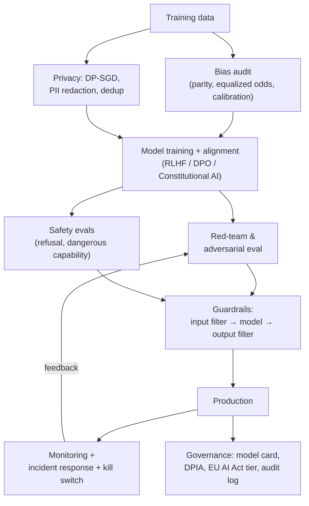
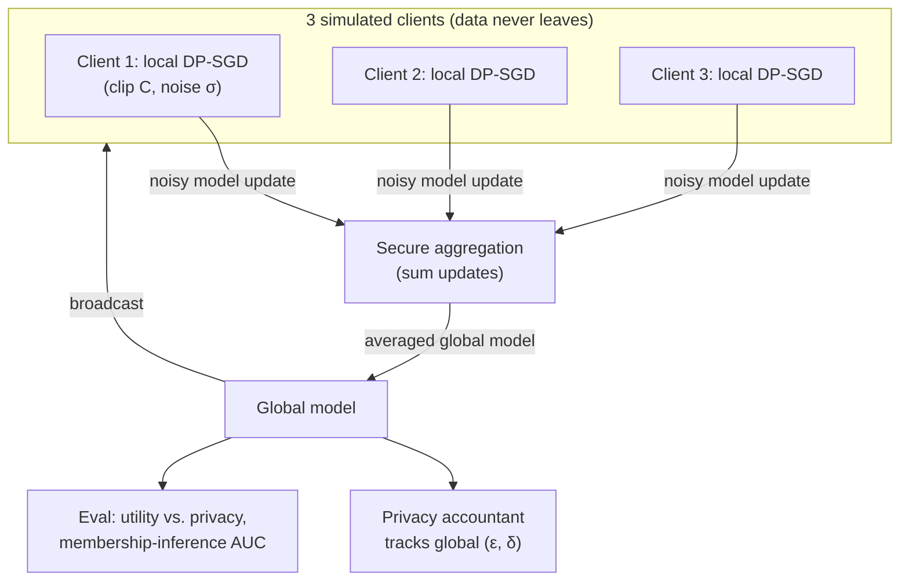

# 6.5 — AI Safety & Responsible AI

## 1. Overview

**What is it?** AI safety and responsible AI is the discipline of building ML systems that minimize harm: models that treat demographic groups equitably (fairness), resist manipulation (robustness), protect the data they were trained on (privacy), refuse to help with dangerous requests while remaining useful (LLM safety and alignment), and operate under documented, auditable governance.

**Why does it exist?** Because deployed models meet the real world, and the real world contains biased historical data, adversarial users, privacy law, and genuinely dangerous use cases. A model that is 95% accurate can still systematically deny loans to one demographic, leak a patient's record it memorized, be flipped by an imperceptible pixel perturbation, or be jailbroken into writing malware. And as models grow more capable, alignment — making systems robustly pursue intended goals — becomes a research problem in its own right.

**What problem does it solve?** It turns vague obligations ("be fair," "be safe," "comply with GDPR") into measurable quantities (demographic-parity gaps, $(\epsilon, \delta)$ privacy budgets, attack success rates, refusal rates) and into engineering artifacts (guardrail pipelines, red-team suites, model cards, incident-response plans).

**Where is it used?** Everywhere models touch people: credit and hiring (fairness law), healthcare (HIPAA, safety-critical decisions), consumer LLM products (jailbreak and prompt-injection defense), autonomous systems, and frontier-lab alignment programs (RLHF, Constitutional AI, dangerous-capability evaluations).

## 2. Learning Objectives

After this chapter you will be able to:

- Define and compute the three canonical fairness metrics — demographic parity, equalized odds, and calibration — and explain why they generally cannot hold simultaneously.
- Identify sources of bias (historical, sampling, label, feedback loops) and match mitigations to each (pre-, in-, and post-processing).
- Derive the FGSM adversarial perturbation from the linearization of the loss, and extend it to PGD.
- Explain adversarial training as a min-max problem and why gradient masking is a false defense.
- State the definition of $(\epsilon, \delta)$-differential privacy and explain each symbol.
- Describe DP-SGD step by step: per-example clipping, noise addition, and privacy accounting.
- Explain membership-inference and model-inversion attacks and which defenses address them.
- Classify LLM attack surfaces: jailbreaks vs. prompt injection vs. data exfiltration.
- Design a layered guardrail architecture (input, output, and system-level defenses).
- Summarize the alignment toolbox — RLHF, Constitutional AI, scalable oversight, dangerous-capability evals.
- Write a model card and map a system onto the EU AI Act's risk tiers and the NIST AI RMF.
- Run a structured red-team exercise and report results responsibly.

## 3. Prerequisites

| Chapter | Why you need it |
|---|---|
| [Logistic Regression](../phase-1-classical-ml/04-logistic-regression.md) | Fairness metrics are defined over classifier decisions and scores. |
| [Evaluation Metrics](../phase-1-classical-ml/14-evaluation-metrics.md) | Per-subgroup TPR/FPR/calibration are the raw material of fairness auditing. |
| [Backpropagation](../phase-2-deep-learning/02-backpropagation.md) | Adversarial examples are built from input gradients; DP-SGD modifies gradient computation. |
| [Optimizers](../phase-2-deep-learning/05-optimizers.md) | DP-SGD is a modified SGD; adversarial training changes the inner loss. |
| [Transformers](../phase-2-deep-learning/10-transformer.md) | LLM safety concerns the behavior of transformer chat models. |
| [RLHF & DPO](../phase-3-nlp-llm/06-rlhf-dpo.md) | RLHF is the primary alignment technique; this chapter places it in the broader safety landscape. |
| [Interpretability](02-interpretability.md) | Auditing and mechanistic interpretability are safety tools; fairness auditing extends attribution analysis. |

## 4. Intuition

Think of deploying an ML system like opening a restaurant. Accuracy is the taste of the food — necessary, nowhere near sufficient. You also need health inspections (bias audits — is one group of customers systematically served worse?), locks and cameras (security against adversaries who *want* to break things), discretion (privacy — the waiter must not repeat what he overheard at table 3), a bouncer with judgment (guardrails — keep out trouble without turning away legitimate guests), and a food-safety log the inspector can read (governance and documentation). A restaurant that only optimizes taste gets shut down; so do ML systems.

Three everyday stories, one per pillar:

- **Fairness:** a hiring model trained on ten years of a company's hires learns that past managers preferred candidates from certain schools and — through proxies like zip code and hobbies — certain demographics. The model is *accurate at predicting past decisions*, which is exactly the problem: it launders historical bias into a neutral-looking score. This is why Amazon scrapped an experimental recruiting tool that had learned to downgrade résumés containing the word "women's."
- **Adversarial robustness:** a stop sign with a few stickers is still obviously a stop sign to you, but a classifier can read it as "Speed Limit 45." The model's decision boundary is astonishingly close to every input in ways human perception is not — and attackers can find the shortest path across it using the model's own gradients.
- **Privacy:** a language model is a lossy compression of its training data — but "lossy" is not "anonymous." Ask it the right way and it may complete a real person's phone number it saw once. Differential privacy is the mathematically precise version of the waiter's discretion: the model's behavior must be *nearly indistinguishable* whether or not your data was in the training set.

The unifying mindset is **adversarial thinking**: assume the distribution will shift, the user will probe, and the metric will be gamed — then design so the system fails safely anyway.

## 5. Real-world Motivation

- **Amazon** discontinued an internal recruiting model after discovering gender bias (Reuters, 2018) — the canonical case study in proxy discrimination.
- **Microsoft's Tay** chatbot was manipulated into producing offensive content within 24 hours of launch (2016) — the founding cautionary tale of adversarial users and missing guardrails.
- The **COMPAS** recidivism-score debate (ProPublica, 2016) showed a system can be calibrated by race yet have unequal false-positive rates — making the impossibility results in Section 6 front-page news.
- **Apple** deployed differential privacy for on-device telemetry, and the **US Census Bureau** used it for the 2020 Census — DP as shipped infrastructure, not theory.
- **Prompt injection** moved from demo to incident class: early Bing Chat's system prompt was extracted by users ("Sydney"), and indirect injection via web pages and emails remains the top LLM security risk (OWASP LLM Top 10, #1).
- **Anthropic** built Claude around Constitutional AI and publishes a Responsible Scaling Policy; **OpenAI** operates a Preparedness Framework; **Google DeepMind** publishes a Frontier Safety Framework — alignment and dangerous-capability evaluation as institutional practice.
- **Regulation is live:** the **EU AI Act** (in force 2024, phased obligations) bans some practices outright and imposes strict duties on high-risk systems; GDPR, HIPAA, and the NIST AI Risk Management Framework shape what production ML must document and prove.

## 6. Mathematical Foundations

### 6.1 Fairness metrics

Setup: binary classifier $\hat{Y} \in \{0, 1\}$ (e.g., approve loan), true outcome $Y \in \{0, 1\}$ (would repay), sensitive attribute $A \in \{a, b\}$ (demographic group), score $S \in [0,1]$.

**Demographic parity (statistical parity):** positive-decision rates are equal across groups,

$$P(\hat{Y} = 1 \mid A = a) = P(\hat{Y} = 1 \mid A = b).$$

Its ratio form is the **disparate-impact ratio** $\text{DIR} = \frac{P(\hat Y = 1 \mid A=a)}{P(\hat Y = 1 \mid A=b)}$; the US "four-fifths rule" flags $\text{DIR} < 0.8$. Parity ignores $Y$ entirely — it can force equal approval rates even when true qualification rates differ.

**Equalized odds (Hardt et al., 2016):** equal error rates across groups — equal true-positive rate *and* equal false-positive rate,

$$P(\hat{Y} = 1 \mid Y = y, A = a) = P(\hat{Y} = 1 \mid Y = y, A = b), \quad y \in \{0, 1\}.$$

Requiring it only for $y = 1$ is **equal opportunity** (qualified people from both groups are approved at the same rate).

**Calibration by group:** among people given score $s$, the fraction with $Y = 1$ is $s$ in every group,

$$P(Y = 1 \mid S = s, A = a) = P(Y = 1 \mid S = s, A = b) = s.$$

**The impossibility result (Kleinberg et al.; Chouldechova, 2016).** If base rates differ ($P(Y{=}1\mid A{=}a) \neq P(Y{=}1\mid A{=}b)$) and the classifier is imperfect, calibration and equalized odds cannot both hold. Via the confusion-matrix identity linking positive predictive value (PPV), TPR, FPR, and base rate $p$,

$$\text{FPR} = \frac{p}{1-p}\cdot\frac{1-\text{PPV}}{\text{PPV}}\cdot\text{TPR},$$

equal PPV and equal TPR across groups force the FPRs to differ whenever the base rates $p$ differ. You must *choose* the fairness notion your application needs: COMPAS was approximately calibrated by race, while ProPublica measured unequal false-positive rates — both true at once, exactly as the theorem predicts.

### 6.2 Adversarial examples: FGSM and PGD

Let $f_\theta$ be a classifier, $x$ an input with true label $y$, and $L$ the loss. An adversary wants a perturbation $\delta$, small in $\ell_\infty$ norm ($\|\delta\|_\infty \le \epsilon$), that maximizes the loss. Linearize $L$ around $x$: $L(x + \delta) \approx L(x) + \nabla_x L^\top \delta$. Subject to $\|\delta\|_\infty \le \epsilon$, the inner product is maximized by aligning $\delta$ with the sign of the gradient — this is the **Fast Gradient Sign Method** (Goodfellow et al., 2015):

$$\delta = \epsilon\, \text{sign}\!\left(\nabla_x L(f_\theta(x), y)\right), \qquad x_{\text{adv}} = x + \delta.$$

**Projected Gradient Descent (PGD, Madry et al., 2018)** iterates FGSM with a small step $\alpha$ and re-projects into the $\epsilon$-ball after each step,

$$x^{(t+1)} = \Pi_{\|\cdot - x\|_\infty \le \epsilon}\!\left(x^{(t)} + \alpha\, \text{sign}(\nabla_x L)\right),$$

where $\Pi$ clips each coordinate back into $[x_i - \epsilon, x_i + \epsilon]$. PGD is the standard strong first-order attack; Carlini–Wagner (C&W) is a stronger optimization-based attack minimizing $\|\delta\|_2$ subject to misclassification.

**Adversarial training** solves the saddle-point problem — minimize the worst-case loss inside the $\epsilon$-ball,

$$\min_\theta\; \mathbb{E}_{(x,y)}\Big[\max_{\|\delta\|_\infty \le \epsilon} L(f_\theta(x + \delta), y)\Big],$$

approximating the inner max with PGD each step. It is the most reliable empirical defense, at 2–3× training cost. **Gradient masking** — making gradients uninformative rather than the model actually robust — gives false security: it defeats gradient-based attacks but falls to transfer or gradient-free attacks, so robustness must be evaluated with adaptive attacks.

### 6.3 Differential privacy and DP-SGD

**Definition.** A randomized algorithm $\mathcal{M}$ is $(\epsilon, \delta)$-differentially private if for all datasets $D, D'$ differing in one record and all outcome sets $O$,

$$P(\mathcal{M}(D) \in O) \le e^{\epsilon}\, P(\mathcal{M}(D') \in O) + \delta.$$

Interpretation: $\epsilon$ (the **privacy budget**) bounds how much any single individual's presence can change the output distribution — smaller $\epsilon$ = more privacy; $\delta$ is a small probability of the bound failing (typically $\delta \ll 1/N$). The guarantee holds *regardless of the adversary's side knowledge* — DP's key strength over ad-hoc anonymization.

**DP-SGD (Abadi et al., 2016)** makes training itself private in three modifications per step:

1. Compute *per-example* gradients $g_i = \nabla_\theta L(x_i)$.
2. **Clip** each to bounded $\ell_2$ norm: $\bar{g}_i = g_i / \max(1, \|g_i\|_2 / C)$ — this bounds any one example's influence (the sensitivity).
3. **Add Gaussian noise** to the summed clipped gradients and average: $\tilde{g} = \frac{1}{B}\big(\sum_i \bar{g}_i + \mathcal{N}(0, \sigma^2 C^2 I)\big)$, where the noise scale $\sigma$ trades privacy for utility.

Total privacy loss over training is tracked by a **privacy accountant** (moments accountant / Rényi DP), which composes the per-step $(\epsilon, \delta)$ across steps and accounts for privacy amplification by subsampling. More steps or larger noise → different $\epsilon$; you report the final $(\epsilon, \delta)$.

### 6.4 Privacy attacks

**Membership inference:** given a data point and query access, decide whether it was in the training set — exploiting that models are more confident on training data (measured by loss/confidence thresholds or shadow models). **Model inversion / extraction:** reconstruct training inputs or steal a model's parameters/behavior via many queries. **Training-data extraction** from LLMs (Carlini et al.) recovers verbatim memorized sequences. DP mitigates membership inference by construction; extraction is also fought with dedup, output filtering, and rate limiting.

### 6.5 LLM safety threat model

- **Jailbreaks:** prompts that bypass the model's own safety training (role-play framings, "DAN," many-shot jailbreaking, low-resource-language or cipher encodings, adversarial suffixes found by optimization à la GCG).
- **Prompt injection:** untrusted content in the model's context (a web page, email, tool output) contains instructions the model then follows — *direct* (user-supplied) vs. *indirect* (arrives via retrieved/tool data). This is the #1 practical LLM risk because the model cannot inherently distinguish "data to process" from "instructions to obey."
- **Data exfiltration:** coaxing the model to reveal its system prompt, other users' data, or secrets in its context; often chained with prompt injection.
- **Harmful generation:** toxicity, hate speech, dangerous instructions, CSAM — the categories content classifiers target.

There is no formula here; the object of study is behavior under adversarial input, quantified by **attack success rate** and **refusal/over-refusal rates**.

### 6.6 Alignment

Alignment makes a model robustly pursue intended goals. The production toolbox: **RLHF** (train a reward model on human preferences, optimize the policy with PPO under a KL leash — full treatment in [RLHF & DPO](../phase-3-nlp-llm/06-rlhf-dpo.md) and the RL theory in [Reinforcement Learning](01-reinforcement-learning.md)); **DPO** (skip the reward model, optimize preferences directly); **Constitutional AI / RLAIF** (use a written set of principles and AI feedback to reduce human-labeling load); **scalable oversight** (debate, recursive reward modeling — supervising models on tasks humans can't easily evaluate); and **dangerous-capability evaluations** (measure whether a model can meaningfully assist with cyber, bio, or autonomy risks before release).

## 7. Visual Explanation

The safety program as a lifecycle:



Layered LLM guardrails (defense in depth):

```
user input ─▶ [input guard: PII scan, injection/jailbreak classifier, policy check]
                     │ (allow / block / sanitize)
                     ▼
              [ LLM policy (safety-tuned) with hardened system prompt ]
                     │
                     ▼
             [output guard: toxicity/harm classifier, PII redaction,
              groundedness/citation check, secret-leak scan]
                     │ (allow / block / rewrite)
                     ▼
              response + full audit log ─▶ monitoring & anomaly detection
```

## 8. Algorithm

**Standing up a safety program, step by step:**

1. **Threat-model** the system: who are the users and adversaries, what harms are possible, what data flows where.
2. **Data audit:** measure subgroup representation and label quality; compute base rates and fairness metrics on held-out data.
3. **Mitigate at the right layer:** pre-processing (reweighing/resampling), in-processing (fairness-constrained training, DP-SGD, adversarial training), or post-processing (group-specific thresholds).
4. **Add guardrails** on both input and output; harden the system prompt; isolate tool/retrieval content as untrusted.
5. **Red-team** with humans and automated tools; record attack success rates.
6. **Human-in-the-loop** for high-stakes or low-confidence decisions.
7. **Monitor** in production for drift, abuse, and safety-metric regressions; wire an incident-response plan and a kill switch.
8. **Document** everything: model card, data card, DPIA/DPA, risk-tier classification.

```text
PSEUDOCODE: DP-SGD training step
--------------------------------
sample minibatch B (Poisson subsampling for amplification)
for each example i in B:
    g_i = grad(loss(model, x_i, y_i))          # PER-EXAMPLE gradient
    g_i = g_i / max(1, ||g_i||_2 / C)          # clip sensitivity to C
g_sum = sum_i g_i + Normal(0, (sigma*C)^2 * I) # add calibrated Gaussian noise
theta = theta - lr * g_sum / |B|               # noisy averaged update
accountant.step(sigma, sampling_rate)          # track cumulative (eps, delta)
```

## 9. Worked Example

**Tiny fairness example by hand.** A loan model's decisions on two groups:

| | Group A | Group B |
|---|---|---|
| Approved / total | 60 / 100 | 30 / 100 |
| Among truly creditworthy ($Y{=}1$): approved / total | 50 / 55 | 25 / 45 |

Demographic parity: $P(\hat Y{=}1|A) = 0.60$ vs. $P(\hat Y{=}1|B) = 0.30$; DIR $= 0.30/0.60 = 0.5 < 0.8$ → fails the four-fifths rule. Equal opportunity (TPR): $50/55 = 0.909$ vs. $25/45 = 0.556$ → a 35-point gap: qualified Group B applicants are approved far less often. Both metrics flag a problem; note the base rates differ ($55\%$ vs. $45\%$ creditworthy), so we cannot fix everything at once — mitigation requires deciding whether equal approval rates or equal treatment of the qualified matters more here.

**FGSM by hand (2-D).** Suppose at input $x = (0.5, 0.5)$ the loss gradient is $\nabla_x L = (2.0, -0.5)$ and budget $\epsilon = 0.1$. Then $\delta = 0.1 \cdot \text{sign}(2.0, -0.5) = (0.1, -0.1)$, so $x_{\text{adv}} = (0.6, 0.4)$ — a perturbation of $\ell_\infty$ size exactly $\epsilon$, pushing every pixel the maximal allowed amount in the loss-increasing direction. On MNIST this same one-step attack drops a 99%-accurate CNN below 30% at $\epsilon = 0.2$.

**Realistic DP example.** Training a model on 60k examples with DP-SGD at clip norm $C = 1.0$, noise $\sigma = 1.1$, batch 256, over 60 epochs, a moments accountant might report $(\epsilon \approx 3, \delta = 10^{-5})$ — a moderate, defensible budget that typically costs a few points of accuracy versus non-private training.

## 10. Python from Scratch

Fairness metrics and an FGSM attack in NumPy (attack shown against a linear model to keep gradients explicit):

```python
import numpy as np

def fairness_report(y_true, y_pred, group):
    """Demographic parity, equal opportunity (TPR), and FPR gaps across two groups."""
    out = {}
    for g in np.unique(group):
        m = group == g
        yt, yp = y_true[m], y_pred[m]
        pos_rate = yp.mean()                                  # P(Ŷ=1 | A=g)
        tpr = yp[yt == 1].mean() if (yt == 1).any() else np.nan   # P(Ŷ=1 | Y=1)
        fpr = yp[yt == 0].mean() if (yt == 0).any() else np.nan   # P(Ŷ=1 | Y=0)
        out[g] = dict(pos_rate=pos_rate, tpr=tpr, fpr=fpr)
    g0, g1 = np.unique(group)
    out["dp_ratio"] = out[g1]["pos_rate"] / out[g0]["pos_rate"]   # four-fifths -> want >=0.8
    out["eo_gap"] = abs(out[g0]["tpr"] - out[g1]["tpr"])          # equal-opportunity gap
    return out

rng = np.random.default_rng(0)
y_true = rng.integers(0, 2, 200)
group = rng.integers(0, 2, 200)
y_pred = ((rng.random(200) < np.where(group == 1, 0.3, 0.6))).astype(int)  # biased by design
print(fairness_report(y_true, y_pred, group))    # dp_ratio ~0.5, eo_gap sizeable

def fgsm_linear(W, b, x, y, eps):
    """One-step FGSM on a logistic model. W:(C,D) b:(C,) x:(D,) y:int."""
    logits = W @ x + b
    p = np.exp(logits - logits.max()); p /= p.sum()          # softmax, shape (C,)
    grad_logits = p.copy(); grad_logits[y] -= 1              # dL/dlogits (cross-entropy)
    grad_x = W.T @ grad_logits                                # dL/dx, shape (D,)
    return x + eps * np.sign(grad_x)                          # step to the ε-boundary

W = rng.normal(size=(3, 5)); b = rng.normal(size=3); x = rng.normal(size=5)
x_adv = fgsm_linear(W, b, x, y=0, eps=0.1)
print("clean pred:", (W @ x + b).argmax(), " adv pred:", (W @ x_adv + b).argmax())
# often flips the predicted class with an ℓ∞ change of only 0.1 per feature
```

**Expected output:** the fairness report shows `dp_ratio ≈ 0.5` (fails four-fifths) and a clear equal-opportunity gap; the FGSM example frequently changes the argmax class with a tiny perturbation. **Complexity:** the fairness report is one $O(N)$ pass; FGSM is one forward + one backward, $O(\text{model})$.

> [!WARNING]
> **Common bug:** computing fairness metrics on the *training* set, or without subgroup sample-size guards. Small subgroups give noisy TPR/FPR estimates (a group with 8 positives has TPR resolution of 1/8), so a "gap" may be sampling noise. Always report confidence intervals and minimum subgroup sizes, and audit on held-out data.

## 11. Library Implementation

The production toolbox: Fairlearn for auditing, Opacus for DP-SGD, torchattacks for adversarial eval, and a guardrail sketch for LLMs.

```python
# --- (a) Fairness audit with Fairlearn ---
from fairlearn.metrics import MetricFrame, demographic_parity_ratio, equalized_odds_difference
from sklearn.metrics import accuracy_score, true_positive_rate, false_positive_rate

mf = MetricFrame(
    metrics={"acc": accuracy_score, "tpr": true_positive_rate, "fpr": false_positive_rate},
    y_true=y_test, y_pred=y_pred, sensitive_features=A_test)     # A_test: group column
print(mf.by_group)                                              # per-group table
print("DP ratio:", demographic_parity_ratio(y_test, y_pred, sensitive_features=A_test))
print("EO diff:", equalized_odds_difference(y_test, y_pred, sensitive_features=A_test))
# Mitigation (post-processing to equalized odds):
from fairlearn.postprocessing import ThresholdOptimizer
opt = ThresholdOptimizer(estimator=clf, constraints="equalized_odds", predict_method="predict_proba")
opt.fit(X_train, y_train, sensitive_features=A_train)           # learns per-group thresholds

# --- (b) DP-SGD with Opacus ---
from opacus import PrivacyEngine
privacy_engine = PrivacyEngine()
model, optimizer, loader = privacy_engine.make_private(
    module=model, optimizer=optimizer, data_loader=loader,
    noise_multiplier=1.1,        # σ: higher = more privacy, less utility
    max_grad_norm=1.0,           # C: per-example gradient clip
)                                # Opacus does per-sample grads + clip + noise automatically
# ... train normally ...
print("ε spent:", privacy_engine.get_epsilon(delta=1e-5))      # accountant reports the budget

# --- (c) Adversarial evaluation with torchattacks ---
import torchattacks
atk = torchattacks.PGD(model, eps=8/255, alpha=2/255, steps=10)  # standard CIFAR ℓ∞ config
x_adv = atk(images, labels)                                     # crafted adversarial batch
robust_acc = (model(x_adv).argmax(1) == labels).float().mean()  # accuracy under attack

# --- (d) Minimal LLM guardrail pipeline (conceptual) ---
def guarded_generate(user_msg, llm, input_guard, output_guard):
    if not input_guard.is_safe(user_msg):        # e.g., Llama-Guard / injection classifier
        return "I can't help with that request."
    reply = llm.generate(system=HARDENED_SYSTEM_PROMPT, user=user_msg)
    verdict = output_guard.check(reply)          # toxicity, PII, secret-leak, groundedness
    if not verdict.safe:
        return output_guard.redact_or_block(reply, verdict)
    log(user_msg, reply, verdict)                # audit trail for incident response
    return reply
```

Line notes: `MetricFrame` slices any metric by group in one call — the workhorse of auditing; `ThresholdOptimizer` implements the Hardt et al. post-processing that achieves equalized odds by group-specific thresholds (a legally sensitive choice — using the protected attribute at decision time may itself be restricted, so consult counsel). Opacus's `make_private` transparently swaps in per-sample gradient computation; `get_epsilon` is what you put in the model card. For LLMs, real systems chain classifier guardrails (**Llama Guard**, **ShieldGemma**, **Prompt Guard**), PII tools (**Presidio**), injection detectors (**Rebuff**), and red-team harnesses (**garak**).

## 12. Code Walkthrough

Inputs, outputs, and shapes:

| Object | Shape / type | Meaning |
|---|---|---|
| `y_true`, `y_pred` | `(N,)` int | Ground truth and decisions for the audited set |
| `A_test` | `(N,)` categorical | Sensitive attribute per example |
| `mf.by_group` | table (groups × metrics) | Per-subgroup accuracy/TPR/FPR |
| `noise_multiplier` σ | scalar | DP noise scale; ↑ = more privacy |
| `max_grad_norm` C | scalar | Per-example clip; bounds sensitivity |
| `get_epsilon(delta)` | scalar | Cumulative privacy budget spent |
| `x_adv` | `(B, C, H, W)` | Adversarial images, $\|x_{adv}-x\|_\infty \le \epsilon$ |
| `robust_acc` | scalar | Accuracy under PGD — the number to report, not clean accuracy |

Sanity checks that catch real bugs: (1) fairness metrics computed on held-out data with per-group $n$ shown; (2) DP `get_epsilon` recomputed after any change to epochs/σ/batch — a common error is reporting a budget from the wrong config; (3) adversarial robustness always evaluated with an *adaptive* attack (steps ≥ 10, multiple restarts) — a defense that only survives FGSM but not PGD is gradient masking; (4) guardrail evaluation reports *both* attack success rate and over-refusal on benign prompts (a guard that blocks everything is trivially "safe" and useless).

## 13. Complexity Analysis

- **Fairness auditing:** $O(N)$ per metric per group — negligible; the cost is data collection and labeling sensitive attributes, not computation.
- **Adversarial training:** each step runs an inner PGD loop of $k$ gradient steps, so ~$(k+1)\times$ normal training cost (typically 2–4× wall-clock).
- **DP-SGD:** per-example gradients defeat the usual batch-matmul vectorization; naive implementations are much slower, though Opacus/functorch vectorized per-sample grads and "ghost clipping" reduce the memory/time overhead to ~1.5–3×. Privacy accounting itself is cheap.
- **Guardrails at inference:** each classifier guard is an extra forward pass; input+output guards can 2–3× per-request latency and cost unless the guards are much smaller than the main model (they usually are — Llama Guard is small relative to a frontier model).
- **Red-teaming:** automated attacks (garak, GCG suffix search) are compute-heavy (many queries/optimization steps); human red-teaming is labor-bound.
- **Space:** additional models (reward model, guardrail classifiers), plus logs — safety adds storage and an audit-retention obligation.

The recurring theme: safety is rarely free, but the *right* comparison is against the cost of the harm (regulatory fines, breach liability, brand damage), which is usually far larger.

## 14. Advantages

- **Legal and market access.** Documented fairness and privacy controls are what let a model ship in credit, healthcare, and the EU at all — safety is often a gate, not a bonus.
- **Quantified, auditable risk.** DP gives a provable $(\epsilon,\delta)$ guarantee that survives arbitrary side information; fairness metrics and attack-success rates turn "is it safe?" into numbers you can track and gate on.
- **Defense in depth catches what any single layer misses.** A jailbreak that slips past the safety-tuned model is still caught by an output classifier; an injected instruction is neutralized by treating tool output as untrusted.
- **Trust drives adoption.** Clinicians, regulators, and enterprise buyers adopt systems with credible safety stories; Anthropic and OpenAI market safety as a differentiator.
- **Alignment techniques improve usefulness too.** RLHF didn't just make models safer — it made them dramatically more helpful and steerable, which is why every major assistant uses it.
- **Cheap relative to incidents.** A red-team program costs far less than a data breach, a discrimination lawsuit, or a public Tay-style failure.

## 15. Disadvantages

- **Real trade-offs.** DP-SGD costs accuracy and compute; adversarial training reduces clean accuracy; aggressive guardrails cause over-refusal that frustrates legitimate users. Safety and capability genuinely pull against each other at the margin.
- **Impossibility constraints.** You cannot satisfy all fairness definitions at once when base rates differ — someone must make a contestable value judgment.
- **No complete defenses.** Prompt injection has no known general solution; adversarial robustness remains unsolved for realistic threat models; every guardrail can be probed around.
- **Cat-and-mouse dynamics.** New jailbreaks and attacks appear continuously; safety is a maintenance commitment, not a one-time task.
- **Measurement is hard and gameable.** Benchmarks can be overfit; a low attack-success rate on a known suite says little about novel attacks; fairness metrics on proxies can mislead.
- **Compliance ≠ safety.** Passing an audit checklist can create false confidence; conversely, genuine safety work may exceed what any regulation specifies.

## 16. Common Mistakes

- **Treating safety as a launch checkbox** instead of a lifecycle. *Fix:* continuous monitoring, scheduled re-red-teaming, and safety regressions gated in CI.
- **Auditing only aggregate metrics.** A model at 92% overall can be 70% for a subgroup. *Fix:* always slice by subgroup, with sample-size-aware confidence intervals.
- **Guardrails on only one side.** Input-only filtering misses harmful *generations*; output-only misses injection that has already executed a tool call. *Fix:* guard input *and* output, and isolate tool/retrieval content.
- **Storing prompts and responses with PII in plaintext logs.** *Fix:* redact at ingestion (Presidio), encrypt, minimize retention, and document in the DPIA.
- **Claiming robustness after evaluating with a weak attack.** *Fix:* adaptive PGD with restarts; report robust accuracy, treat FGSM-only results as suspect (gradient masking).
- **Misreporting the privacy budget** (e.g., ignoring that more epochs spend more $\epsilon$). *Fix:* take $\epsilon$ from the accountant for the exact final config.
- **Using the protected attribute in the deployed decision without legal review.** Post-processing fairness fixes often do this. *Fix:* involve counsel; prefer mitigations legal in your jurisdiction.
- **No incident-response plan or kill switch.** *Fix:* define severities, on-call, rollback, and disclosure procedures *before* launch.

## 17. Best Practices

- **Threat-model first**, then design controls to the specific harms — not a generic checklist.
- **Fairness:** pick the metric that matches the harm (equal opportunity for allocation of a benefit; parity where representation matters); measure pre- and post-mitigation; document the value choice explicitly.
- **Privacy:** minimize and dedup data, redact PII, apply DP-SGD where individual-level guarantees are needed, and rate-limit query access to blunt extraction/membership attacks.
- **Robustness:** for perception models in adversarial settings, adversarial-train and evaluate with adaptive attacks; for others, at least monitor for distribution shift.
- **LLM defense in depth:** hardened system prompt + input classifier + output classifier + tool sandboxing + least-privilege for any actions the model can take; never let model output directly trigger irreversible actions without confirmation.
- **Red-team continuously** with both automated tools and humans; feed findings back into training data and guardrails.
- **Human-in-the-loop** for high-stakes, low-confidence, or contested decisions.
- **Govern and document:** model card, data card, DPIA, EU AI Act risk-tier classification, and NIST AI RMF mapping; keep an audit log and an incident-response runbook.
- **Re-evaluate after any model change** — including compression (see [Model Compression](04-model-compression.md)), which can shift refusal and fairness behavior.

## 18. Optimization Techniques

- **Layered classifiers over one big filter:** cheap heuristic/regex → small classifier → LLM judge only for ambiguous cases, minimizing latency and cost.
- **Small, specialized guard models** (Llama Guard, ShieldGemma) instead of a second frontier call — most of the protection at a fraction of the cost.
- **Adversarial data augmentation:** fold discovered jailbreaks and adversarial examples back into fine-tuning so the base model itself refuses them, shrinking reliance on external guards.
- **Efficient DP-SGD:** vectorized per-sample gradients (functorch), ghost clipping, and larger batches (which improve the privacy/utility trade-off via amplification) reduce DP's overhead.
- **Automated red-teaming** (garak, model-generated adversarial prompts, GCG) to scale coverage beyond manual testing.
- **Cache guard decisions** for repeated/near-duplicate inputs; **batch** guard classification alongside the main request.
- **Calibrated thresholds:** tune guard operating points on a labeled set to hit target attack-success and over-refusal rates rather than guessing.

## 19. Industry Applications

- **Consumer LLMs (production):** OpenAI, Anthropic, Google, and Meta ship safety-tuned models behind guardrail stacks; Meta open-sourced Llama Guard and Prompt Guard, Google released ShieldGemma — guardrails as reusable components.
- **Finance & hiring:** fairness auditing and adverse-action reason codes are operational requirements at banks and large employers under ECOA, FCRA, and emerging hiring-audit laws (e.g., NYC Local Law 144).
- **Privacy at scale:** Apple (on-device DP telemetry), Google (RAPPOR, DP for analytics), the US Census Bureau (2020 Census disclosure avoidance), and DP-trained models for sensitive domains.
- **Healthcare:** HIPAA-driven de-identification (Presidio-style PII redaction), human-in-the-loop for diagnostic decisions, and calibration/fairness checks across patient subgroups.
- **Frontier-lab safety programs:** Anthropic's Constitutional AI, Responsible Scaling Policy, and interpretability; OpenAI's Preparedness Framework and red-team network; Google DeepMind's Frontier Safety Framework and dangerous-capability evals; UK AI Safety Institute and MLCommons AILuminate benchmarks.
- **Security tooling:** OWASP LLM Top 10 now guides enterprise LLM deployment; vendors ship prompt-injection and data-loss-prevention layers for agentic systems.

## 20. Interview Questions

### Beginner

**Q: Name the pillars of responsible AI.**
A: Fairness/bias mitigation, robustness/security, privacy, transparency/interpretability, safety (including LLM safety and alignment), and governance/accountability. Together they cover harms across the model lifecycle.

**Q: What is demographic parity, and one weakness?**
A: Equal positive-decision rates across groups: $P(\hat Y{=}1|A{=}a) = P(\hat Y{=}1|A{=}b)$. Weakness: it ignores the true outcome $Y$, so it can force equal approval rates even when genuine qualification rates differ — sometimes harming the intended group.

**Q: What is an adversarial example?**
A: An input with a small, often imperceptible perturbation crafted to make the model misclassify — e.g., FGSM adds $\epsilon\,\text{sign}(\nabla_x L)$. It exploits how close decision boundaries lie to normal inputs.

**Q: What is a jailbreak vs. a prompt injection?**
A: A jailbreak is a prompt that bypasses the model's own safety training (role-play, adversarial suffixes). Prompt injection is untrusted *content* (a web page, tool output) that contains instructions the model then follows — the model can't inherently tell data from commands.

**Q: What goes in a model card?**
A: Intended use and out-of-scope uses, training data summary, evaluation results including per-subgroup performance, fairness/safety limitations, ethical considerations, and contact/governance info — standardized documentation for accountability.

### Intermediate

**Q: State $(\epsilon, \delta)$-differential privacy and interpret the symbols.**
A: For datasets differing in one record, $P(\mathcal{M}(D)\in O) \le e^\epsilon P(\mathcal{M}(D')\in O) + \delta$. $\epsilon$ bounds how much one individual can change the output distribution (smaller = more private); $\delta$ is a small failure probability. The guarantee holds against any side knowledge.

**Q: Walk through DP-SGD.**
A: Per-example gradients → clip each to $\ell_2$ norm $C$ (bounding sensitivity) → sum, add Gaussian noise $\mathcal{N}(0, \sigma^2 C^2 I)$, average → step. A privacy accountant composes per-step costs (with subsampling amplification) into a final $(\epsilon, \delta)$.

**Q: Why can't you satisfy calibration and equalized odds simultaneously?**
A: Because with unequal base rates, PPV, TPR, and FPR are algebraically linked ($\text{FPR} = \frac{p}{1-p}\frac{1-\text{PPV}}{\text{PPV}}\text{TPR}$); fixing calibration (PPV) and TPR equal across groups forces FPR to differ. You must choose which notion your context requires (the COMPAS debate).

**Q: Derive FGSM.**
A: Maximize $L(x+\delta)$ subject to $\|\delta\|_\infty \le \epsilon$. Linearize: $L(x+\delta)\approx L(x)+\nabla_x L^\top\delta$. The constrained maximizer of the linear term is $\delta = \epsilon\,\text{sign}(\nabla_x L)$ — push every coordinate to the box boundary in the ascent direction.

**Q: Design a defense against prompt injection in a RAG system.**
A: Treat retrieved content as untrusted data, never as instructions (delimit and label it in the prompt); use least-privilege tools with human confirmation for irreversible actions; run an input/output injection classifier; strip instruction-like patterns from retrieved text; and monitor for anomalous tool calls. Note there is no complete solution — layer defenses and constrain blast radius.

### Advanced

**Q: Why is gradient masking a false sense of security, and how should robustness be evaluated?**
A: Gradient masking makes gradients uninformative (obfuscation) rather than making the model truly robust; it defeats gradient-based attacks like PGD but falls to transfer attacks (from a surrogate) or gradient-free attacks. Evaluate with *adaptive* attacks designed against the specific defense, multiple restarts, and sanity checks (unbounded attack should reach ~0% accuracy; black-box shouldn't beat white-box) — per Athalye et al.'s "obfuscated gradients."

**Q: What are membership-inference and training-data-extraction attacks, and how does DP help?**
A: Membership inference decides if a point was in training (exploiting higher confidence on training data); extraction recovers verbatim memorized sequences from generative models. DP directly bounds membership inference (an individual barely changes the output distribution, so presence is hard to detect) and limits memorization; complementary defenses include deduplication, output filtering, and rate limiting.

**Q: Compare RLHF, DPO, and Constitutional AI as alignment methods.**
A: RLHF trains a reward model on human preferences and optimizes the policy with PPO under a KL penalty (flexible, complex, reward-hackable). DPO reparameterizes the RLHF objective to optimize preferences directly with a simple classification-style loss — no reward model or RL loop, more stable, though sometimes less expressive. Constitutional AI/RLAIF replaces much human labeling with AI feedback guided by written principles, improving scalability and consistency of harmlessness. Details in [RLHF & DPO](../phase-3-nlp-llm/06-rlhf-dpo.md).

**Q: How does the EU AI Act structure obligations, and where would a hiring-screening model fall?**
A: Risk tiers: *unacceptable* (banned — e.g., social scoring), *high-risk* (strict duties — risk management, data governance, transparency, human oversight, conformity assessment), *limited-risk* (transparency, e.g., disclosing you're talking to a bot), and *minimal-risk*. Employment/hiring systems are explicitly **high-risk**, triggering the full obligation set plus documentation and post-market monitoring.

**Q: What is scalable oversight and why is it needed?**
A: As models tackle tasks humans can't easily evaluate (long proofs, large codebases, novel research), direct human feedback becomes unreliable. Scalable oversight — debate between models, recursive reward modeling, AI-assisted evaluation, weak-to-strong generalization — aims to let limited human judgment supervise superhuman capabilities. It's an open research area central to aligning future systems.

## 21. Coding Exercises

### Easy

1. **Fairness dashboard.** On the UCI Adult dataset, train a classifier and compute demographic-parity ratio, equal-opportunity gap, and per-group calibration with Fairlearn; flag violations of the four-fifths rule. *Hint:* `MetricFrame` with `sensitive_features=sex`.
2. **FGSM on MNIST.** Attack a trained CNN with FGSM at $\epsilon \in \{0, 0.1, 0.2, 0.3\}$; plot accuracy vs. $\epsilon$ and display flipped examples. *Hint:* one gradient of the loss w.r.t. the input, then `sign`.

### Medium

1. **Post-processing mitigation.** Apply Fairlearn's `ThresholdOptimizer` (equalized odds) to your Adult model; report the accuracy cost and remaining gaps; discuss the legal caveat of using the protected attribute at decision time. *Hint:* compare fairness metrics before vs. after.
2. **DP-SGD trade-off curve.** Train a model on MNIST/CIFAR with Opacus at noise multipliers giving $\epsilon \in \{1, 3, 8\}$; plot accuracy vs. $\epsilon$ against the non-private baseline. *Hint:* fix $\delta = 10^{-5}$; report each $\epsilon$ from `get_epsilon`.
3. **Adversarial training.** Implement PGD adversarial training on CIFAR-10 (ResNet-18, $\epsilon = 8/255$); report clean and robust accuracy vs. a standard model. *Hint:* generate PGD examples each batch; expect lower clean but far higher robust accuracy.

### Hard

1. **Adaptive-attack evaluation.** Build a defense (e.g., input smoothing or a detector) that appears robust to FGSM, then break it with an adaptive PGD attack — demonstrating gradient masking. *Hint:* if unbounded PGD doesn't reach ~0% accuracy, your evaluation is masked.
2. **Prompt-injection red-team harness.** Wire `garak` (or a custom suite) against an open-source chat model with and without a Llama-Guard input filter; report attack-success rate and benign over-refusal for both. *Hint:* include indirect injection via simulated retrieved documents.
3. **Membership-inference attack + DP defense.** Implement a shadow-model membership-inference attack against a target classifier; then retrain the target with DP-SGD and show the attack AUC drops toward 0.5. *Hint:* attack features = per-example loss/confidence.

## 22. Mini Project

**Bias & fairness audit of a hiring model with mitigation.**

1. Train a screening classifier on a public dataset with a sensitive attribute (Adult income as a proxy, or a hiring dataset); establish baseline accuracy.
2. Audit with Fairlearn: demographic-parity ratio, equal-opportunity gap, and calibration by group; visualize per-group confusion matrices with confidence intervals.
3. Apply two mitigations — one pre-processing (reweighing/resampling) and one post-processing (`ThresholdOptimizer`) — and measure the accuracy vs. fairness trade-off for each.
4. Write the value-judgment section: which fairness metric fits a hiring context and why; document the legal caveat of using the protected attribute at inference.
5. Deliverable: a short audit report (metrics table, trade-off plot, recommendation) plus a mini model card.

## 23. Medium Project

**Guardrails + red-team suite for a customer-support chatbot.**

1. Stand up a chatbot over an open model (e.g., Llama-3-Instruct) with a hardened system prompt and a small RAG knowledge base.
2. Implement input guardrails (PII scan via Presidio, an injection/jailbreak classifier such as Prompt Guard) and output guardrails (toxicity/PII/secret-leak checks, groundedness against the retrieved context).
3. Build a red-team suite: direct jailbreaks, indirect injection embedded in retrieved documents, and PII-exfiltration attempts (run `garak` plus custom cases).
4. Measure attack-success rate and benign over-refusal rate with and without guardrails; tune guard thresholds to a target operating point.
5. Add logging with PII redaction and a simple incident-response runbook (severity levels, rollback, disclosure).
6. Deliverable: the guarded system, the red-team report (before/after table), and the runbook.

## 24. Advanced Project

**Privacy-preserving federated learning with DP-SGD across simulated clients.**

*Architecture:*



*Implementation phases:*

1. **Partition** a dataset across 3 non-IID clients; establish a centralized, non-private baseline for reference accuracy.
2. **Federated averaging (FedAvg):** implement local training + server aggregation; confirm it approaches the centralized baseline.
3. **Add DP:** apply DP-SGD locally (Opacus) with per-client clipping and noise; track privacy with an accountant (client- or record-level DP — state which).
4. **Attack & measure:** run a membership-inference attack against the non-private and DP models; show the AUC drops toward 0.5 as $\epsilon$ shrinks.
5. **Trade-off study:** sweep $\epsilon \in \{1, 3, 8, \infty\}$ and non-IID severity; plot accuracy, privacy budget, and attack AUC.
6. **Document** the threat model, guarantees, and residual risks (e.g., secure aggregation assumptions).

*Possible improvements:* add secure aggregation (cryptographic sum so the server never sees individual updates), client-level DP with the correct amplification, personalization layers to recover non-IID accuracy, and robustness to malicious clients (Byzantine-robust aggregation).

## 25. Summary

- Responsible AI operationalizes fairness, robustness, privacy, LLM safety/alignment, and governance into measurable quantities and concrete artifacts.
- The three fairness metrics — demographic parity, equalized odds, calibration — cannot all hold when base rates differ; choosing among them is a value judgment, not a bug.
- Bias enters through historical, sampling, and label sources plus feedback loops; mitigate pre-, in-, or post-processing, and audit per subgroup with confidence intervals.
- Adversarial examples exploit near-boundary inputs: FGSM = $\epsilon\,\text{sign}(\nabla_x L)$, PGD iterates and projects; adversarial training is the min-max defense, and robustness must be tested with adaptive attacks.
- $(\epsilon,\delta)$-DP bounds any individual's influence on the output; DP-SGD achieves it via per-example clipping + Gaussian noise + a privacy accountant, at a real accuracy/compute cost.
- LLM attack surfaces — jailbreaks, prompt injection (the #1 practical risk), data exfiltration, harmful generation — need defense in depth: input guard + hardened model + output guard + tool sandboxing.
- Alignment tools: RLHF, DPO, Constitutional AI/RLAIF, scalable oversight, and dangerous-capability evaluations.
- Governance means model cards, DPIAs, EU AI Act risk-tiering, NIST AI RMF mapping, incident response, and human-in-the-loop for high stakes.
- Safety involves genuine trade-offs and has no complete defenses — it is a continuous, adversarial, maintenance commitment.
- Re-evaluate safety after every model change, including compression and fine-tuning, which can shift refusal and fairness behavior.

## 26. Cheat Sheet

| Concept | Formula / Rule |
|---|---|
| Demographic parity | $P(\hat Y{=}1\mid A{=}a) = P(\hat Y{=}1\mid A{=}b)$ |
| Disparate-impact ratio | ratio of positive rates; flag $< 0.8$ |
| Equalized odds | equal TPR *and* FPR across groups |
| Equal opportunity | equal TPR across groups |
| FGSM | $x_{adv} = x + \epsilon\,\text{sign}(\nabla_x L)$ |
| PGD | iterate FGSM step $\alpha$, project to $\epsilon$-ball |
| $(\epsilon,\delta)$-DP | $P(\mathcal M(D)\in O) \le e^\epsilon P(\mathcal M(D')\in O) + \delta$ |
| DP-SGD | per-example clip $C$ → add $\mathcal N(0,\sigma^2C^2I)$ → account $(\epsilon,\delta)$ |

**Defaults:** four-fifths rule for DIR; DP $\epsilon \le \sim3$ strong, $\le 8$ common, clip $C=1.0$; PGD eval $\epsilon=8/255$, 10+ steps, restarts; guardrails on input *and* output.

**LLM defense stack:** hardened system prompt → input classifier (Llama Guard / Prompt Guard) → safety-tuned model → output classifier + PII redaction (Presidio) → tool sandbox + human confirm for irreversible actions → audit log + monitoring.

**Gotchas:** audit on held-out data with subgroup CIs; adaptive attacks only (FGSM-only = masking); recompute $\epsilon$ per config; guard both sides; never let model output trigger irreversible actions unconfirmed; re-run safety evals after compression/fine-tuning.

## 27. Further Reading

**Books**
- Barocas, Hardt & Narayanan, *Fairness and Machine Learning: Limitations and Opportunities* (free online — the standard text).
- Dwork & Roth, *The Algorithmic Foundations of Differential Privacy* (the DP monograph).
- Christian, *The Alignment Problem*; Russell, *Human Compatible*.

**Research Papers**
- Hardt, Price & Srebro, "Equality of Opportunity in Supervised Learning" (2016); Chouldechova (2016) and Kleinberg et al. (2016) on fairness impossibility.
- Goodfellow et al., "Explaining and Harnessing Adversarial Examples" (FGSM, 2015); Madry et al., "Towards Deep Learning Models Resistant to Adversarial Attacks" (PGD, 2018); Athalye et al., "Obfuscated Gradients" (2018).
- Abadi et al., "Deep Learning with Differential Privacy" (DP-SGD, 2016); Shokri et al., "Membership Inference Attacks" (2017); Carlini et al., "Extracting Training Data from Large Language Models" (2021).
- Christiano et al., "Deep RL from Human Preferences" (2017); Ouyang et al., "InstructGPT" (2022); Bai et al., "Constitutional AI" (2022); Rafailov et al., "DPO" (2023); Zou et al., "Universal and Transferable Adversarial Attacks on Aligned LLMs" (GCG, 2023).

**Documentation**
- NIST AI Risk Management Framework; EU AI Act (official text and summaries); OWASP Top 10 for LLM Applications.
- Fairlearn, Opacus, and Microsoft Responsible AI documentation; Google's PAIR "People + AI Guidebook."

**GitHub Repositories**
- `fairlearn/fairlearn`, `Trusted-AI/AIF360`, `pytorch/opacus`, `Harry24k/adversarial-attacks-pytorch`, `NVIDIA/garak`, `microsoft/presidio`, `protectai/rebuff`, `meta-llama/PurpleLlama` (Llama Guard, Prompt Guard).

**Datasets**
- UCI Adult (income), COMPAS (recidivism), German Credit — fairness benchmarks; RealToxicityPrompts, AdvBench (jailbreak), HarmBench, and MLCommons AILuminate for LLM safety.

**YouTube / Videos**
- Anthropic and OpenAI safety talks; the "Fairness in ML" tutorials from NeurIPS/FAccT; Nicholas Carlini's talks on adversarial ML and privacy.

**Blogs**
- Anthropic's alignment and interpretability posts; OpenAI safety blog; Google DeepMind safety research; the AI Incident Database (incidentdatabase.ai) for real-world failure case studies.
