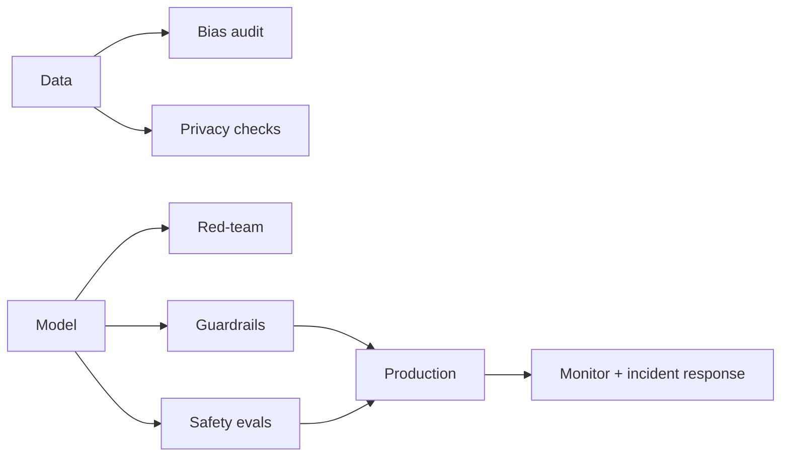

# 6.5 — AI Safety & Responsible AI

## 1. Intuition first
Powerful models can produce toxic content, leak private data, encode biases, be jailbroken, or hallucinate. Safety and responsibility mean designing systems that minimize harm, comply with law, and remain trustworthy at scale.

## 2. Why the topic exists
- Real users are diverse and adversarial.
- Regulation (GDPR, EU AI Act, HIPAA) forces compliance.
- Reputational and legal risk.
- Alignment research addresses long-term risks from increasingly capable models.

## 3. What problem it solves
Reduces harms from ML/LLM systems: bias, misinformation, privacy leaks, security vulnerabilities, and misuse.

## 4. Topics

### 4.1 Bias & fairness
- Statistical parity, equalized odds, calibration by subgroup.
- Sources: label bias, sampling bias, historical bias, feedback loops.
- Mitigations: re-sampling, re-weighting, fairness constraints, post-processing.

### 4.2 Robustness & adversarial attacks
- Adversarial examples (FGSM, PGD, C&W).
- Data poisoning / backdoors.
- Model extraction & inversion.
- Defenses: adversarial training, certified defenses, gradient masking (weak), input preprocessing.

### 4.3 Privacy
- Membership inference; model inversion.
- Differential privacy (DP-SGD).
- Federated learning.
- PII redaction and de-identification.

### 4.4 LLM safety
- Jailbreaks / prompt injection.
- Data exfiltration via prompts.
- Hallucinations & mis-attribution.
- Toxicity, hate speech, CSAM prevention.
- Guardrail models: Llama-Guard, ShieldGemma, Prompt Guard.
- Red-teaming, automated adversarial prompt generation.

### 4.5 Alignment research
- RLHF / DPO / constitutional AI.
- Scalable oversight.
- Mechanistic interpretability.
- Model evaluations for dangerous capabilities.

### 4.6 Governance
- Model cards, data cards, system cards.
- Policy compliance (SOC 2, ISO 27001, HIPAA, GDPR, EU AI Act, NIST AI RMF).
- Incident response plans.
- Human-in-the-loop for high-stakes decisions.

## 5. Formulas
DP-SGD: clip per-example grad, add Gaussian noise $\mathcal{N}(0, (C\sigma)^2 I)$; privacy cost tracked via $(\epsilon, \delta)$.

## 6. Variables
Fairness metrics, privacy budget $\epsilon$, attack success rate, refusal rate.

## 7. Algorithm — safety program
1. Threat model your system.
2. Data audit & bias analysis.
3. Add guardrails (input + output).
4. Adversarial testing / red-team.
5. Human-in-the-loop for sensitive actions.
6. Continuous monitoring (5.5) with safety metrics.
7. Incident response + kill switch.
8. Documentation (model card, DPA, DPIA).

## 8. Simple example
Loan model shows 20% approval-rate gap between demographic groups → mitigate via re-weighting + review.

## 9. Real-world example
- Amazon's recruiting AI scrapped for gender bias.
- Microsoft Tay quickly hijacked.
- LLM prompt-injection incidents (chatbot leaking system prompts).
- Anthropic's constitutional AI approach.

## 10. Diagram

## 11. Implementation from scratch
Toy: compute fairness metrics with `fairlearn.metrics`; PGD attack with a few lines of PyTorch.

## 12. Implementation using libraries
- **fairlearn**, **aif360** — fairness auditing.
- **opacus** (Meta) — DP-SGD in PyTorch.
- **garak** — LLM red-teaming.
- **Llama-Guard**, **ShieldGemma** — content classifiers.
- **Rebuff** — prompt-injection detection.
- **presidio** — PII detection & redaction.
- **CleverHans / Foolbox** — adversarial attacks/defenses.

## 13. Time complexity
Adversarial training is 2–3× normal training. Guardrail models add latency.

## 14. Space complexity
Additional models & logs.

## 15. Advantages
Trust, compliance, brand safety, long-term viability.

## 16. Disadvantages
Can trade off accuracy or capability; increases pipeline complexity.

## 17. Interview questions
1. Fairness metrics: parity vs equalized odds vs calibration.
2. Design a prompt-injection defense.
3. Differential privacy — intuition and DP-SGD.
4. Red-teaming an LLM — process.
5. Guardrails architecture.
6. What is a model card?
7. Regulatory landscape (EU AI Act tiers).
8. Adversarial examples defenses.
9. Data poisoning and backdoors.
10. How to responsibly disclose model risks.

## 18. Common mistakes
- Treating safety as a checkbox.
- Ignoring subgroup performance.
- Guardrails only on input or only on output.
- Storing prompts/responses with PII.
- No incident-response plan.

## 19. Optimization techniques
Layered defenses; combining classifier + heuristic + LLM judge; adversarial data augmentation; continuous red-team automation.

## 20. Coding exercises
1. Compute fairness metrics on Adult income dataset.
2. Train with DP-SGD via Opacus; measure privacy budget.
3. Implement FGSM attack + adversarial training on MNIST.
4. Run garak on an open-source LLM.

## 21. Mini project
Bias & fairness audit of a hiring model, with mitigation experiments.

## 22. Medium project
Implement input/output guardrails + red-team suite for a customer chatbot.

## 23. Advanced project
Federated learning + DP-SGD demo across three simulated clients; document trade-offs.

## 24. Where it is used in industry
Every consumer-facing LLM and regulated ML system.

## 25. How companies use it
- Anthropic: constitutional AI + interpretability + evals.
- OpenAI: red-team, safety systems team.
- Google DeepMind: safety cases + dangerous capability evals.
- Regulated industries: strict compliance frameworks.

## 26. When NOT to use it
Never skip. Even research prototypes should think about safety before public release.
